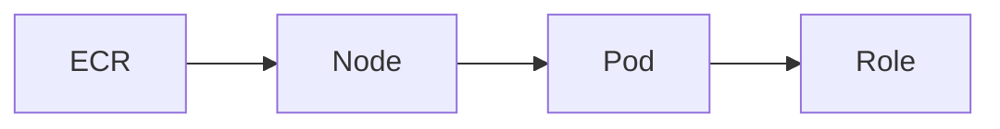

# EKS

Cloud · 20 min

EKS is Kubernetes with AWS under it. Pods, services, and IAM roles remain your problem.

## Flow



## EKS

The control plane is managed. You still write Deployments, probes, and HPA. The node group is EC2. The pod role reaches S3 and RDS. kubectl is the same as the local cluster. The project runs here after Compose is boring. CKAD is the exam after you can debug a crash on this cluster or a local one.

## Play this

1. Name it
2. Say the rule
3. Tie it to the project or a problem
4. One sentence from memory tomorrow

## Steps

- Read the rule once.
- Write the example from a blank file.
- Say the interview answer out loud.

## Example

```text
Image in ECR. Manifest in git. Role on the pod.
```

## The usual miss

EKS as a way to avoid learning pods.

## They will ask

What does EKS not operate for you?

## Before you close the laptop

Name Deployment, Service, and the role.
