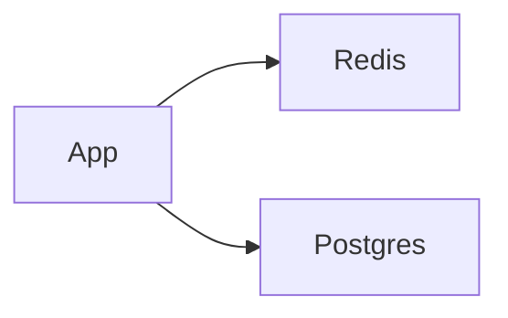

# ElastiCache

Cloud · 15 min

ElastiCache is managed Redis. Cache, rate limit, and agent session.

## Flow



## ElastiCache

Same rules as the Redis lesson. Eviction can drop a key. Postgres remains the source for buckets. A session blob may disappear and the agent starts again. Multi-AZ replica for failover. Do not use it as a queue if you already have Kafka. Security group from the app only.

## Play this

1. Name it
2. Say the rule
3. Tie it to the project or a problem
4. One sentence from memory tomorrow

## Steps

- Read the rule once.
- Write the example from a blank file.
- Say the interview answer out loud.

## Example

```text
TTL 60s on metadata. Session TTL 30 min.
```

## The usual miss

Putting the only copy of an approval in Redis.

## They will ask

What survives a flush?

## Before you close the laptop

Name the three keys.
