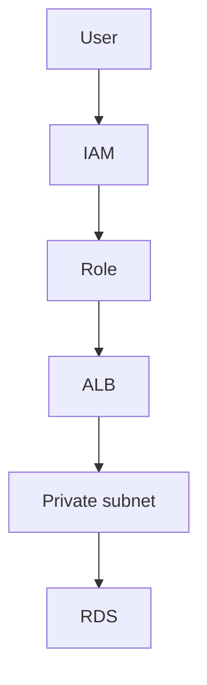

# IAM and VPC before any service

Cloud · 40 min

Solutions Architect Associate is the credential, later. The knowledge starts with who can call what, and which network path exists. Cloud Practitioner is the wrong exam for you.

## Flow



## Play this

1. No long-lived keys on laptops
2. Roles for services
3. Database is private
4. Security groups are stateful

## Steps

- IAM user is a person. A role is what EC2, EKS, or Lambda assumes. Policies are the allow list.
- VPC, public subnet for the load balancer, private subnet for the app and the database.
- Security group on the database allows the app group on 5432 and nothing from the internet.

## Example

```text
SAA is the supporting certificate after you can draw this. Do not start with Cloud Practitioner.
```

## The usual miss

Opening port 22 to the world because a tutorial did.

## They will ask

How does the pod reach S3 without an access key in the image?

## Before you close the laptop

Draw the VPC once. Photograph it. That is this week's cloud note.
