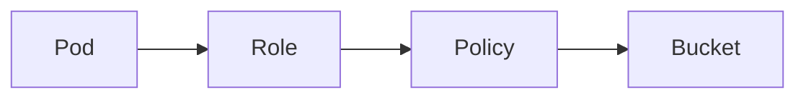

# IAM

Cloud · 20 min

IAM is who can call what. Every other AWS box hangs off a role.

## Flow



## IAM

A policy allows actions on resources. The pod assumes a role. A human assumes a different role. Root is not a daily login. No long-lived key in the image. The agent role can read metrics and cannot delete a bucket. The executor role can, and only the approved path uses it.

## Play this

1. Name it
2. Say the rule
3. Tie it to the project or a problem
4. One sentence from memory tomorrow

## Steps

- Read the rule once.
- Write the example from a blank file.
- Say the interview answer out loud.

## Example

```text
s3:GetObject on one bucket. Not s3:* .
```

## The usual miss

A star action on a star resource.

## They will ask

How does the pod reach S3 without a key in the jar?

## Before you close the laptop

Write the two roles: reader and executor.
