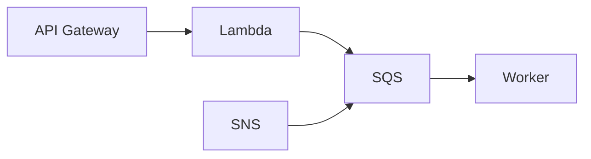

# SQS, SNS, Lambda, API Gateway

Cloud · 30 min

AWS messaging is the managed version of the event story. Kafka remains the project log. SQS is the simpler queue when you do not need replay.

## Flow



## When SQS is the right box

You need a buffer and a worker, you do not need to replay a year of events, and you do not need order across a key for the long term. Object-created notifications can land on SQS. The diagnostics stream that you want to replay belongs on Kafka. Say that distinction. It is the senior answer.

## Lambda limits

A function is stateless, time-boxed, and billed in memory-time. It is a good fit for a thumbnail or a webhook ack. The agent that calls tools, waits for a human, and writes an audit row is a service. Put it in the FastAPI process you already planned.

## Play this

1. SQS is a queue
2. SNS is fanout
3. Lambda is a small function
4. API Gateway is the front door

## Steps

- SQS: at-least-once, visibility timeout, dead-letter queue. The handler is idempotent. A message returns if you do not delete it.
- SNS: one publish, many subscribers. Use it to fan out. Use SQS behind a subscriber when that subscriber must buffer.
- Lambda fits a short transform. A long agent loop does not belong in a 15-minute function with a cold start you have not measured.
- API Gateway terminates HTTP and can authorize. For the project, the ALB in front of Spring is enough until you have a reason.

## Example

```text
Visibility timeout 30s.
Handler finishes in 5s and deletes.
If the handler dies, the message reappears.
The second run sees the idempotency key.
```

## The usual miss

Using Lambda because the diagram looked modern.

## They will ask

SQS delivered the same message twice. What in your code makes that safe?

## Before you close the laptop

On paper, which project event is Kafka and which could be SQS, and why.
