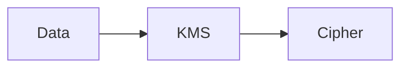

# KMS

Cloud · 15 min

KMS holds keys that encrypt S3, RDS, and secrets. You do not hold the raw key.

## Flow



## KMS

A customer managed key if you need to control rotation and the policy. The default AWS managed key is a start. The agent role can decrypt only what it must read. A key policy that allows everyone is the same bug as a public bucket.

## Play this

1. Name it
2. Say the rule
3. Tie it to the project or a problem
4. One sentence from memory tomorrow

## Steps

- Read the rule once.
- Write the example from a blank file.
- Say the interview answer out loud.

## Example

```text
Encrypt the bucket and the database. Separate keys if the agent must not read bytes.
```

## The usual miss

One key for everything, aliased to everyone.

## They will ask

Who can decrypt the object bucket?

## Before you close the laptop

Name the key's users.
