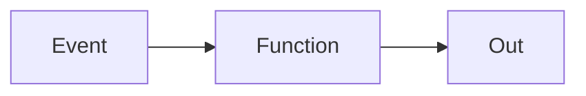

# Lambda

Cloud · 15 min

Lambda is a short function. The agent loop is not one.

## Flow



## Lambda

Time-boxed, stateless, cold starts. A good fit for a small transform or an alarm hook. A bad fit for a human approval that waits. The diagnose route stays on FastAPI. Say the limit out loud so you are not the candidate who puts every box on Lambda.

## Play this

1. Name it
2. Say the rule
3. Tie it to the project or a problem
4. One sentence from memory tomorrow

## Steps

- Read the rule once.
- Write the example from a blank file.
- Say the interview answer out loud.

## Example

```text
Alarm to a function that posts a line. Agent stays a service.
```

## The usual miss

A 10-minute agent inside a function because the diagram looked new.

## They will ask

What work do you refuse to put on Lambda?

## Before you close the laptop

Name one hook that does fit.
