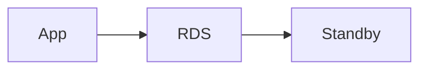

# RDS

Cloud · 20 min

RDS is managed Postgres. Transactions, the outbox, and metadata live here.

## Flow



## RDS

Multi-AZ is a standby for failover, not a read-scaling strategy. Read replicas lag. A read-your-write goes to the primary. Backups and a restore you have timed. The security group allows the app only. Parameter groups are not where you start. The interview line: the source of truth is Postgres, and RDS is how you run it.

## Play this

1. Name it
2. Say the rule
3. Tie it to the project or a problem
4. One sentence from memory tomorrow

## Steps

- Read the rule once.
- Write the example from a blank file.
- Say the interview answer out loud.

## Example

```text
Primary for writes. Replica lag is real.
```

## The usual miss

Sending the create-read to a replica.

## They will ask

What does Multi-AZ not do for read scale?

## Before you close the laptop

Name primary versus replica.
