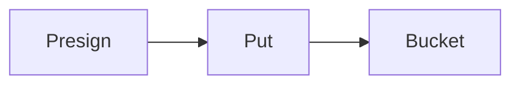

# S3

Cloud · 20 min

S3 holds the bytes. It is durable object storage, not a filesystem.

## Flow



## S3

A bucket, a key, a presigned PUT for the client. Versioning if you must recover a delete. Block public access. Encryption with KMS. Storage classes are a later cost talk. Consistency for new PUTs is what you rely on for a subsequent GET. The synthetic objects for the project live here, or in a local stand-in with the same API shape.

## Play this

1. Name it
2. Say the rule
3. Tie it to the project or a problem
4. One sentence from memory tomorrow

## Steps

- Read the rule once.
- Write the example from a blank file.
- Say the interview answer out loud.

## Example

```text
presign PUT, then complete in Postgres
```

## The usual miss

A public bucket for a demo that stayed public.

## They will ask

Who uploads, the app or the client?

## Before you close the laptop

Say presign in one sentence.
