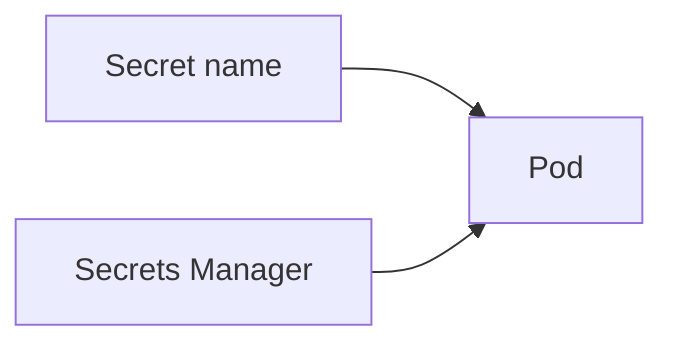

# Secrets Manager

Cloud · 15 min

The password lives in Secrets Manager. Git stores the name.

## Flow



## Secrets Manager

Rotation is possible. The pod reads at start or through a CSI driver. A .env in the repo is a failure. KMS wraps the secret. The agent does not receive the database password if it only calls the Java API.

## Play this

1. Name it
2. Say the rule
3. Tie it to the project or a problem
4. One sentence from memory tomorrow

## Steps

- Read the rule once.
- Write the example from a blank file.
- Say the interview answer out loud.

## Example

```text
DB password in Secrets Manager. Repo has the name.
```

## The usual miss

A committed application-local.yml with the password.

## They will ask

What is in git?

## Before you close the laptop

Check the repo for a password.
