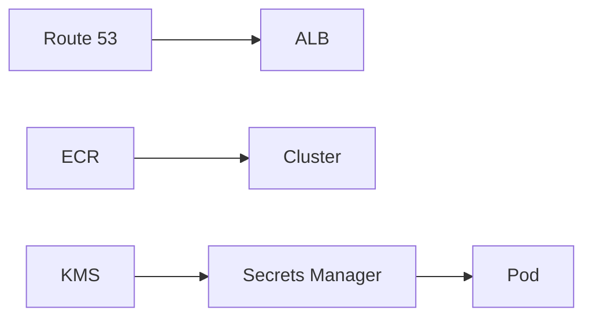

# KMS, secrets, ECR, Route 53

Cloud · 25 min

The security half of AWS is who can call, where the secret lives, and how the image got there.

## Flow



## Identity

IAM decides. A policy allows s3:GetObject on one bucket. The pod assumes a role through the cluster's identity mechanism. A human uses a role too. Root is not a daily login. CloudTrail records the calls. That is the security story that pairs with the agent: the tool the agent can call is a role with a short list of actions, not an admin key.

## Images and names

You build a jar, then an image, then you push to ECR. The Deployment pins the digest or the tag you just pushed. Route 53 is only the name the laptop uses to reach the ALB. None of these require the Cloud Practitioner exam.

## Play this

1. IAM role on the pod
2. Secrets are not env files in git
3. ECR holds the image
4. KMS wraps the key

## Steps

- A pod uses an IAM role. Long-lived access keys on a laptop are for the experiment, then they go away.
- Secrets Manager or SSM holds the database password. The manifest references the secret. The git repo does not.
- ECR stores the image. The cluster pulls it. Scan it. Pin the tag you deployed.
- KMS encrypts S3, RDS, and the secret. Rotation is a feature you can name.
- Route 53 maps the name to the load balancer. A health check removes a bad region later, not in version one.

## Example

```text
The repo contains a secret name.
The cluster injects the value.
git log never shows the password.
```

## The usual miss

Committing an AWS key because the demo was on Friday.

## They will ask

How does the pod reach S3 without an access key in the image?

## Before you close the laptop

Check the project for a password in a file. Move the name into a note, not the value.
