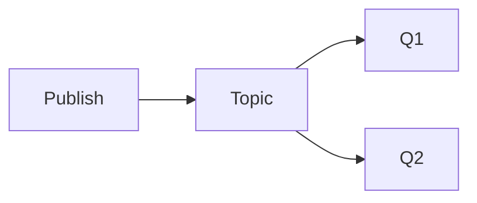

# SNS

Cloud · 15 min

SNS fans out one publish to many subscribers.

## Flow



## SNS

Put SQS in front of a subscriber that must buffer. A raw HTTP subscription loses messages when the receiver is down. Use SNS when several systems need the same notification and you do not need a log. The object-event log stays Kafka. A 'bucket created' page to humans can be SNS.

## Play this

1. Name it
2. Say the rule
3. Tie it to the project or a problem
4. One sentence from memory tomorrow

## Steps

- Read the rule once.
- Write the example from a blank file.
- Say the interview answer out loud.

## Example

```text
SNS to SQS, not SNS to a fragile webhook, for anything you must not lose.
```

## The usual miss

A webhook subscriber and no queue.

## They will ask

When is SNS the wrong bus?

## Before you close the laptop

One sentence: fanout, not replay.
