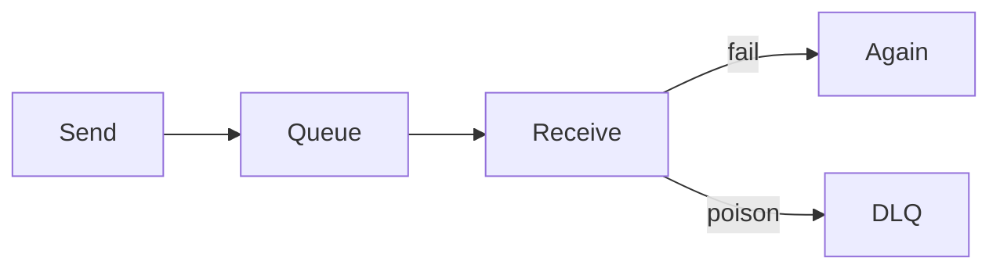

# SQS

Cloud · 20 min

SQS is a queue. Visibility timeout, delete on success, dead-letter for poison.

## Flow



## SQS

At-least-once. The handler is idempotent. If you do not delete, the message returns after the visibility timeout. Set the timeout longer than the handler. A DLQ after a few receives. Use SQS when you do not need replay. Use Kafka when you do. The project can send a thumbnail-style side job to SQS and keep object events on Kafka.

## Play this

1. Name it
2. Say the rule
3. Tie it to the project or a problem
4. One sentence from memory tomorrow

## Steps

- Read the rule once.
- Write the example from a blank file.
- Say the interview answer out loud.

## Example

```text
delete only after the work commits
```

## The usual miss

A visibility timeout shorter than the work, so two workers run it.

## They will ask

The handler crashes. What does SQS do?

## Before you close the laptop

Write timeout and max receives.
