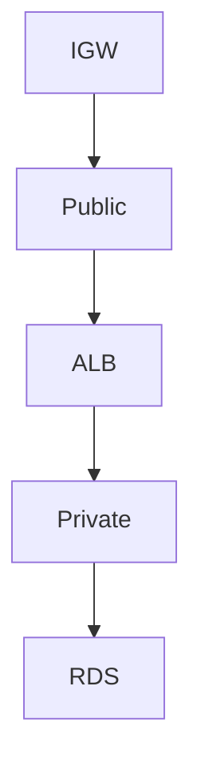

# VPC

Cloud · 20 min

The VPC is the network you can draw. Public subnets for the load balancer. Private subnets for the app and the database.

## Flow



## VPC

A route table sends 0.0.0.0/0 from a public subnet to the internet gateway. A private subnet reaches the internet through NAT only if it must. Security groups are stateful. The database allows 5432 from the app security group, not from the world. If you can draw this, SAA is a credential, not a course.

## Play this

1. Name it
2. Say the rule
3. Tie it to the project or a problem
4. One sentence from memory tomorrow

## Steps

- Read the rule once.
- Write the example from a blank file.
- Say the interview answer out loud.

## Example

```text
ALB in public. App and RDS in private.
```

## The usual miss

A database in a public subnet because it was faster to click.

## They will ask

Where does the load balancer sit, and who can open 5432?

## Before you close the laptop

Draw four boxes. Label the security groups.
