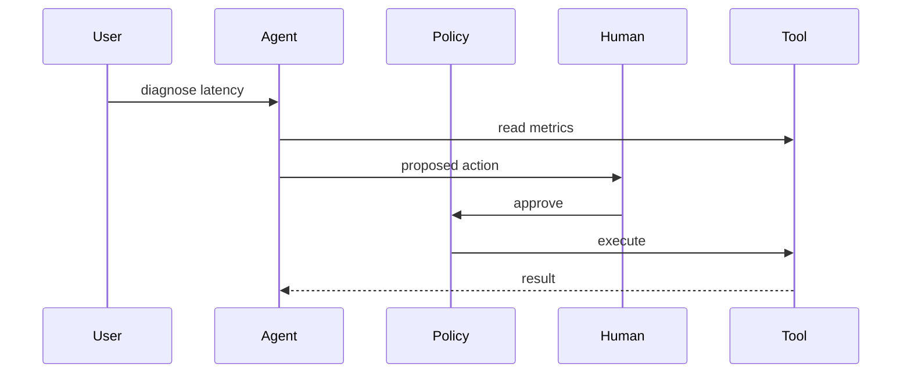

# Agent orchestration with a human gate

Design · 40 min

The differentiator. An agent may suggest a change. It may not apply the change until a person approves, the tool is allow-listed, and the call is idempotent.

## Flow



## Walk it

An orchestrator holds state. Specialist agents read logs, metrics, or config. A tool executor checks an allow-list and a human approval for anything that mutates. Every call has a timeout and a trace id. The platform is the project. In a design interview you draw the gate before you draw a second model.

## Play this

1. Read tools are wider
2. Write tools need approval
3. Timeouts and retries
4. Trace every tool call

## Steps

- Split tools into read and write. Diagnostics are read. A config change is write.
- The approval record stores who, what, and the idempotency key.
- Prompt injection in a log line must not be able to call the write tool. The model does not hold the credential. The policy service does.

## Example

```text
Tool list: getMetrics, getLogs, proposeScale. Only proposeScale needs a human.
```

## The usual miss

Giving the model a kubeconfig.

## They will ask

How do you stop an agent from looping on a tool?

## Before you close the laptop

Draw the approval box on the flagship diagram before you write more code.
