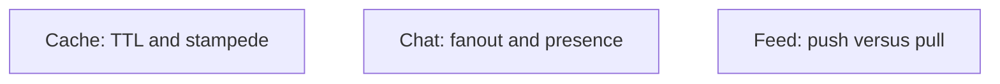

# Cache, chat, and feed in one sitting

Design · 45 min

Three designs share a spine. Learn the part that makes each one different, not three new religions.

## Flow




## Play this

1. Cache is freshness
2. Chat is a channel per conversation
3. Feed is fanout on write or read
4. All three need a queue

## Steps

- Distributed cache: cache aside, TTL, single-flight on miss. Redis in front of Postgres.
- Chat: a connection tier, a message log, fanout to online users, store for history. Presence is ephemeral.
- Feed: push to followers' inboxes when celebrities are rare. Pull or a hybrid when one account has millions of followers.

## Example

```text
The hard part of chat is not the bubble. It is ordering in a conversation and not losing a message on reconnect.
```

## The usual miss

Designing all three as a single database table.

## They will ask

When does feed fanout on write fall over?

## Before you close the laptop

Pick feed. Say push, pull, or hybrid in one sentence and why.
