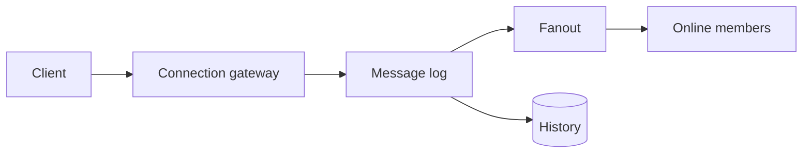

# Chat

Design · 40 min

Chat is a log plus a connection tier. The hard part is order inside a conversation and a client that reconnects.

## Flow



## What makes it different from a cache

A cache can drop data. A chat log cannot. Presence and typing are the cache-like parts: they expire. Messages are the database. Fanout to online users is best-effort on top of the log. Read receipts can wait. Say what you cut.

## Requirements

Send a message, receive it, and catch up after a reconnect.

## Scale estimation

Messages per second per conversation. Sockets are not the storage.

## API

send(conversationId, clientMsgId, body). History by cursor.

## Data model

Message id, conversation id, body, time. Presence is separate and ephemeral.

## High-level architecture

A gateway holds sockets. A log stores messages. Fanout reaches online members.

## DB

The log is the source. A conversation is a partition.

## Caching

Presence and the recent fanout. Not the history.

## Queue

Fanout to online members. The log is durable.

## Consistency

clientMsgId dedupes. Order is per conversation.

## Failure handling

Crash after store and before fanout: the client catch-up repairs it.

## Observability

Send latency and fanout lag.

## Security

A member check on send. Encryption is a sentence if asked.

## Trade-offs

Keeping history only on the gateway loses it on restart.

## Play this

1. A channel is a partition
2. Store then fanout
3. Presence is ephemeral
4. Reconnect sends the last seen id

## Steps

- Send, receive, history, typing if you have time. One conversation, then groups.
- Scale: messages per second, not concurrent sockets alone. A socket is a connection. The log is the product.
- API: send(conversationId, clientMsgId, body). History by cursor.
- The conversation id is the partition key so one conversation stays ordered.
- On reconnect the client sends the last message id. The server replays after that id.

## Example

```text
clientMsgId makes send idempotent.
The server stores the message, then fans it out.
A crash after store and before fanout is repaired by the client catch-up.
```

## The usual miss

Keeping history only in the memory of the gateway.

## They will ask

Two devices send, one socket drops. What does the client send on reconnect?

## Before you close the laptop

Draw the log and the last-seen id. Stop there.
