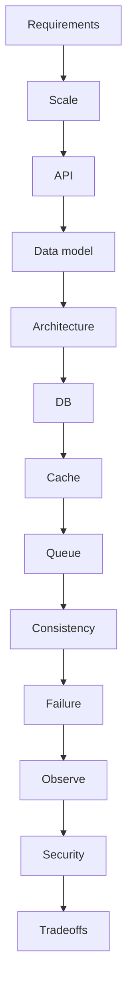

# How every design is told

Design · 20 min

SDE II loops at Amazon and Microsoft put HLD next to DSA. You use the same spine every time so you do not freeze on the noun they picked.

## Flow



## Play this

1. Clarify read and write
2. One number for scale
3. API then data
4. Failure before you stop

## Steps

- Functional requirements in five bullets. Non-functional: latency, availability, consistency.
- Back-of-envelope: QPS, storage per day, read/write ratio. Order of magnitude is enough.
- End on trade-offs. A design with no trade-off is a drawing.

## Example

```text
40 minutes. Talk first. Draw second. No video until you have spoken.
```

## The usual miss

Jumping to Kafka because it sounds senior.

## They will ask

What did you refuse to build in v1?

## Before you close the laptop

Run the spine on a system you already operate. Eight minutes.
