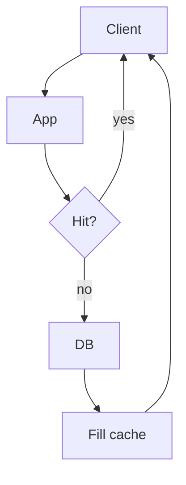

# Distributed cache

Design · 40 min

Cache is a design on its own because freshness, stampedes, and failure are the whole question.

## Flow



## Walk the checklist

Requirements and the staleness you will accept come first. Scale is the hot key, not the average key. The API does not change. The data model is the key and the TTL. Architecture is cache-aside in front of Postgres. Consistency is eventual within the TTL, plus an explicit delete on update. Observability is hit ratio and fill latency. Security is a cache that does not hold raw credentials. The trade-off is freshness against database load.

## Play this

1. Cache aside
2. TTL matches the tolerance
3. Single-flight on a miss
4. Redis down has a decision

## Steps

- Requirements: read-heavy bucket metadata, 5 minutes of staleness is acceptable, writes are rare.
- Scale: state the read QPS and the row size. The cache holds the hot set, not the whole table.
- API stays the same. The cache is invisible to the caller.
- Data: key is bucket id. Value is the metadata JSON. TTL 60 seconds.
- Failure: on Redis timeout, read the database. Latency rises. Correctness holds. A stampede uses a lock or single-flight so one request fills the key.

## Example

```text
Key: bucket:{id}
TTL: 60s
Miss: one filler, others wait or hit the database
Invalidate on write, TTL as the backstop
```

## The usual miss

Caching the write path and serving a stale capacity number as if it were live.

## They will ask

A hot key expires and a thousand requests miss together. What do you do?

## Before you close the laptop

Say the TTL for bucket metadata and why that number.
