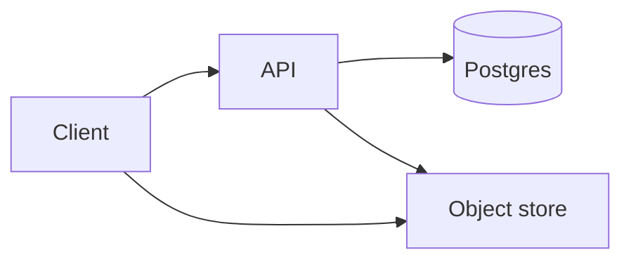

# File and object storage

Design · 40 min

This is the design closest to your storage background. Metadata in a database, bytes in object storage, upload in parts.

## Flow



## Walk it

Bytes go to object storage in parts. Metadata and the part list go to Postgres. Complete assembles the object. A presigned URL lets the client upload without proxying the bytes through your app. This is the flagship's storage, synthetic. Dedup and encryption are sentences if time remains. The metadata write and the event use the outbox.

## Play this

1. Metadata is not the bytes
2. Multipart upload
3. Checksum
4. Lifecycle

## Steps

- The API issues an upload plan. The client sends parts to object storage.
- Complete is a metadata transaction: all parts present, checksum matches, object becomes visible.
- A garbage collector deletes abandoned parts. Say the delay.

## Example

```text
HEAD for existence. GET via a short-lived signed URL.
```

## The usual miss

Storing the file bytes in Postgres.

## They will ask

A part never arrives. What does the user see?

## Before you close the laptop

Tell this design with a bucket you invent. No Dell hostnames or schemas.
