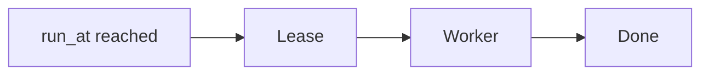

# Job scheduler

Design · 45 min

One worker owns a job. A lease is how you get that with a database.

## Flow



## Requirements

Run a capacity check every hour and a retention sweep nightly. Jobs must not run twice on two pods.

## Scale estimation

Tens of jobs, not millions. Correctness matters more than throughput.

## API

No public API in version one. An admin can enqueue. The worker polls.

## Data model

Job: id, type, run_at, lease_until, payload, attempts.

## High-level architecture

One table. Workers in the Java service. A poll updates the lease.

## DB

Postgres. The conditional update is the lock.

## Caching

None. The table is small.

## Queue

None required at this size. A queue if the backlog grows.

## Consistency

The lease update is one transaction. The work after it is idempotent because a slow worker can lose the lease.

## Failure handling

Worker dies: lease expires, another takes it. Handler dedupes. Attempts increment. Too many attempts park the job.

## Observability

Jobs running, jobs overdue, lease steals.

## Security

Only the service account updates the table.

## Trade-offs

A database lease is enough. A second scheduler product is not.

## Play this

1. Say the trick first
2. Walk all 13 lines
3. Put a number on scale
4. End on the trade-off

## Steps

- Run a capacity check every hour and a retention sweep nightly. Jobs must not run twice on two pods.
- Tens of jobs, not millions. Correctness matters more than throughput.
- No public API in version one. An admin can enqueue. The worker polls.
- Job: id, type, run_at, lease_until, payload, attempts.

## Example

```text
UPDATE job SET lease_until = now() + interval '30 seconds'
WHERE id = ? AND lease_until < now()
```

## The usual miss

Stopping after the boxes and skipping failure.

## They will ask

Two pods run cron. How many times does the job run?

## Before you close the laptop

Close the laptop only after the trade-off is one sentence you can say.
