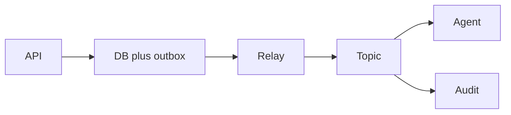

# Kafka event system

Design · 45 min

A fact several services must see, including a replay. This is the flagship's object event.

## Flow



## Requirements

Publish object-created and object-deleted. Consumers are the agent, an audit log, and a search indexer. The HTTP caller does not wait for them.

## Scale estimation

Assume 50 events per second average and a 10x burst. A few kilobytes per event. Retention 7 days so RCA can replay.

## API

The write API returns when the database commits. There is no public 'publish' API. Consumers use a group id per service.

## Data model

Event: id, bucket id, type, bytes, time. The key is bucket id. The id is the idempotency key.

## High-level architecture

API writes Postgres. Relay reads the outbox. Kafka is the log. Consumers are separate processes.

## DB

Postgres is the source. Kafka is the log. The consumer has its own offset and its own tables.

## Caching

Consumers may cache bucket metadata. The event is not cached as the source.

## Queue

The outbox is the queue between the transaction and Kafka. Kafka buffers slow consumers.

## Consistency

Order per bucket. No global order. At-least-once. Consumers dedupe on event id.

## Failure handling

Relay crash: the outbox row remains. Consumer crash: redelivery. Poison: DLQ. Disk full on the broker is an alert, not a silent drop.

## Observability

Lag per consumer group. Outbox age. DLQ depth.

## Security

Producers and consumers use their own credentials. The event carries no secret and no Dell data.

## Trade-offs

Replay and fanout against operational cost. REST would have been simpler and would have coupled the agent to the API being up.

## Play this

1. Say the trick first
2. Walk all 13 lines
3. Put a number on scale
4. End on the trade-off

## Steps

- Publish object-created and object-deleted. Consumers are the agent, an audit log, and a search indexer. The HTTP caller does not wait for them.
- Assume 50 events per second average and a 10x burst. A few kilobytes per event. Retention 7 days so RCA can replay.
- The write API returns when the database commits. There is no public 'publish' API. Consumers use a group id per service.
- Event: id, bucket id, type, bytes, time. The key is bucket id. The id is the idempotency key.

## Example

```text
One commit. Then a relay. Then a consumer that can run twice.
```

## The usual miss

Stopping after the boxes and skipping failure.

## They will ask

Why is the HTTP response not waiting for the agent?

## Before you close the laptop

Close the laptop only after the trade-off is one sentence you can say.
