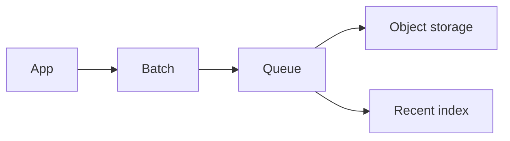

# Log aggregation

Design · 45 min

Logs are for the RCA agent and for you. They are buffered, then stored, then indexed only for the recent window.

## Flow



## Requirements

Search recent logs by request id and bucket id. Keep bulk logs cheaply.

## Scale estimation

A burst of errors can be 100x the steady rate for a minute. The buffer absorbs it.

## API

Query by request id and time range. No full-text product in version one.

## Data model

Line: time, request id, bucket id, level, message. Bulk files are hourly objects.

## High-level architecture

Agents on each pod batch lines. A queue. An object store. A small index for 48 hours.

## DB

The index holds recent lines. The object store holds the rest.

## Caching

The last few minutes can sit in memory on the query side.

## Queue

The queue is the shock absorber. Kafka or SQS both fit. Pick the one you already run.

## Consistency

A line may arrive twice. The request id plus timestamp plus message hash dedupes in the index.

## Failure handling

Queue full: the agent drops debug lines first and keeps errors. Say that policy.

## Observability

Ingest lag. Dropped lines. Query latency.

## Security

Logs can contain ids, not passwords and not customer payloads. The agent reads the same store.

## Trade-offs

Cheap bulk storage against a fast index. You do not index a year of debug lines.

## Play this

1. Say the trick first
2. Walk all 13 lines
3. Put a number on scale
4. End on the trade-off

## Steps

- Search recent logs by request id and bucket id. Keep bulk logs cheaply.
- A burst of errors can be 100x the steady rate for a minute. The buffer absorbs it.
- Query by request id and time range. No full-text product in version one.
- Line: time, request id, bucket id, level, message. Bulk files are hourly objects.

## Example

```text
Errors are kept. Debug is dropped first. The request id joins the trace.
```

## The usual miss

Stopping after the boxes and skipping failure.

## They will ask

The indexer is down. Where are the lines?

## Before you close the laptop

Close the laptop only after the trade-off is one sentence you can say.
