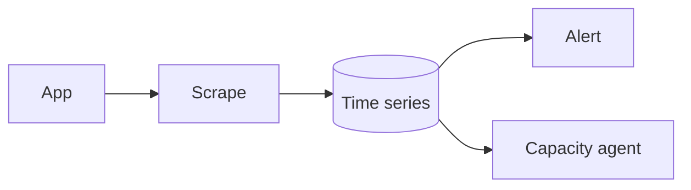

# Metrics system

Design · 45 min

A metric is a number you can alert on. The capacity agent reads the same series.

## Flow



## Requirements

Latency, error rate, and bytes used. Alert before the disk hits 80 percent.

## Scale estimation

One sample per pod per 15 seconds. Resolution falls after 15 days.

## API

The agent queries used-bytes for a bucket over 7 days. Humans look at a dashboard.

## Data model

Counter, gauge, histogram. Labels are low cardinality: service, route, bucket only if the bucket set is small. Not request id.

## High-level architecture

Micrometer or the client exposes a scrape. Prometheus or CloudWatch stores. Alertmanager or an alarm pages.

## DB

The time-series database. Not Postgres.

## Caching

The latest point can be cached. History is the store.

## Queue

Remote write can buffer. Do not put samples on Kafka unless you already need replay.

## Consistency

A missed scrape is a gap, not a zero. Say that, or the capacity forecast lies.

## Failure handling

Store down: keep a short local buffer, then drop. The page fires on the missing scrape too.

## Observability

Scrape success, alert fire, cardinality.

## Security

Metrics endpoints are not public. No labels with emails or raw keys.

## Trade-offs

A specialized store against stuffing counters in Postgres.

## Play this

1. Say the trick first
2. Walk all 13 lines
3. Put a number on scale
4. End on the trade-off

## Steps

- Latency, error rate, and bytes used. Alert before the disk hits 80 percent.
- One sample per pod per 15 seconds. Resolution falls after 15 days.
- The agent queries used-bytes for a bucket over 7 days. Humans look at a dashboard.
- Counter, gauge, histogram. Labels are low cardinality: service, route, bucket only if the bucket set is small. Not request id.

## Example

```text
request id is a log field, never a metric label.
```

## The usual miss

Stopping after the boxes and skipping failure.

## They will ask

Why is a missing scrape not a zero?

## Before you close the laptop

Close the laptop only after the trade-off is one sentence you can say.
