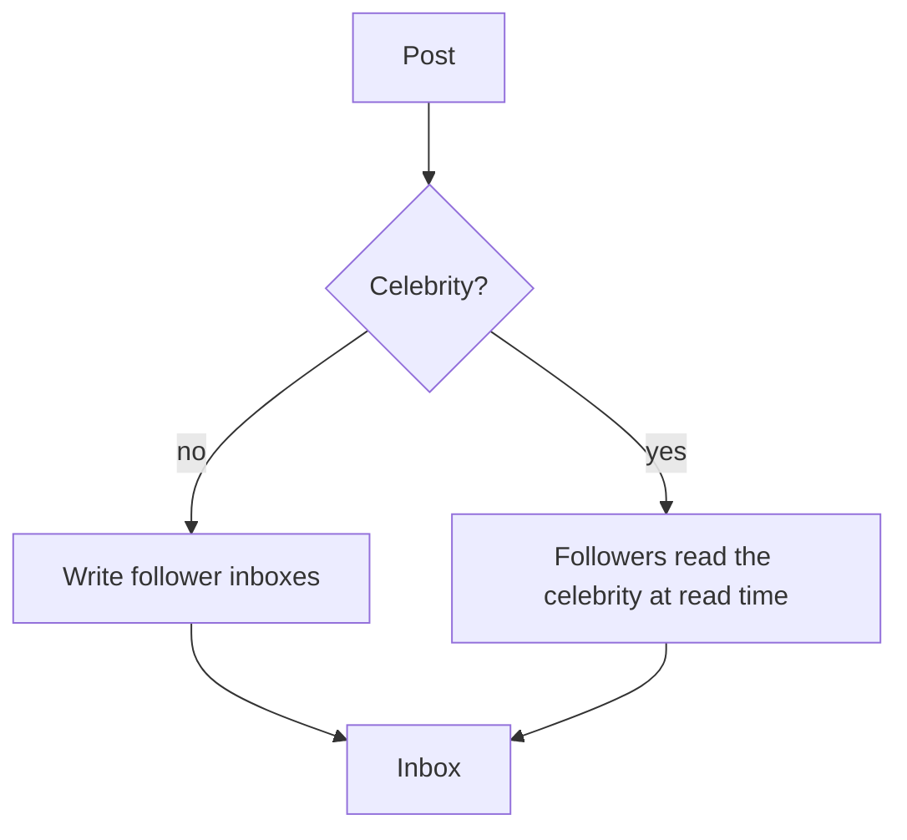

# News feed

Design · 35 min

The trick is fanout. Push the post to followers when followers are few. Pull, or mix, when one account has millions.

## Flow



## Checklist in short

The queue is the fanout work. The cache is the rendered page of the inbox. Consistency is eventual: a post appears within seconds. Failure of a fanout worker retries. A poison post goes to a dead letter so one bad body does not block the worker. Observability is fanout lag.

## Play this

1. Fanout on write for normal users
2. Fanout on read for celebrities
3. The feed is a ranked inbox
4. The post store is the source

## Steps

- Requirements: home feed, follow, post. Ranking can be recency in version one.
- Scale: follows are uneven. Design for the heavy followee.
- Post is stored once. Inbox rows are post ids, not copies of the text.
- A hybrid: push to the first N followers, pull the rest at read time.

## Example

```text
Normal user: on post, enqueue fanout, workers append the id to follower inboxes.
Celebrity: skip the fanout. At read, merge the celebrity's recent posts into the inbox.
```

## The usual miss

Copying the full post into every follower's row.

## They will ask

When does fanout on write fall over?

## Before you close the laptop

Say hybrid in one sentence with the threshold you invented, and call it an assumption.
