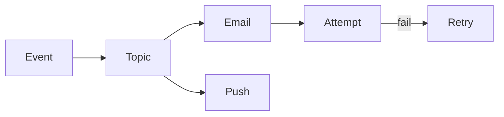

# Notification system

Design · 40 min

Fanout, retries, and idempotent delivery. This is the Kafka design with a user-visible result.

## Flow



## Walk it

A request writes a notification row and an outbox row. Workers send email, push, or webhook. Each send has a provider id so retries do not double-send. A dead letter holds addresses that bounce. Fanout to many devices is a queue, not a loop in the request. Idempotency is the provider key plus the notification id.

## Requirements

Deliver a message to email, push, or a webhook. At least once, and the user can stand a duplicate more than a loss only if you dedupe.

## Scale estimation

Fanout is the spike. A popular alert is many devices.

## API

POST /notifications with an idempotency key. Status by id.

## Data model

Notification, channel, provider id, state.

## High-level architecture

API writes the row and the outbox. Workers send.

## DB

Postgres for state.

## Caching

Template cache. Not the send state.

## Queue

Outbox then a worker queue. One queue per channel if a slow provider must not block email.

## Consistency

The provider id makes a retry safe. State moves created, sent, failed.

## Failure handling

Provider timeout: retry with the same provider id. Bounce: DLQ.

## Observability

Send latency, DLQ depth, duplicate rate.

## Security

A webhook URL is validated. The body is not an open redirect.

## Trade-offs

Synchronous send is simpler and falls over when the provider is slow.

## Play this

1. Event in
2. One worker per channel
3. Retry with backoff
4. Do not double-send

## Steps

- The API accepts the intent and returns. Delivery is async.
- Idempotency key so a retry does not email twice.
- Preferences and quiet hours are a filter before the provider call.

## Example

```text
notification_id unique at the provider adapter.
```

## The usual miss

Calling the email vendor inside the user request.

## They will ask

The worker crashes after the vendor accepts. Did the user get two mails?

## Before you close the laptop

Map this onto an incident notice for a bucket, with synthetic users.
