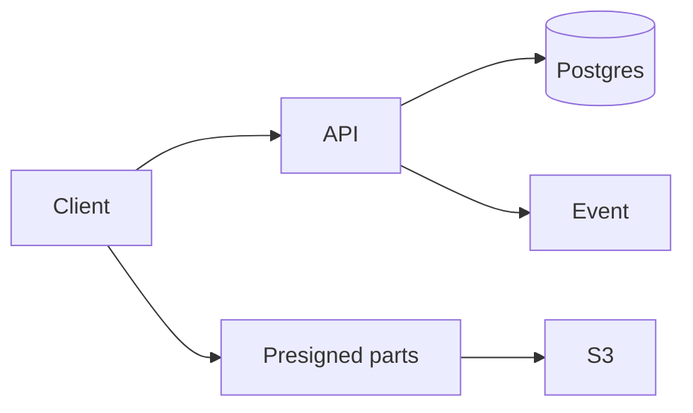

# Object storage

Design · 45 min

Bytes in the object store. Metadata and the part list in Postgres. This is the system the agents operate.

## Flow



## Requirements

Create a bucket, upload an object in parts, read it, delete it. Synthetic data only.

## Scale estimation

Large objects, modest request rate. The bytes do not pass through the Java process.

## API

POST bucket, POST object to start a multipart upload, complete, GET metadata, presign GET.

## Data model

Bucket, object, part etag, version. The event id for the outbox.

## High-level architecture

API for metadata. Presigned URLs for bytes. Event log after commit.

## DB

Postgres for metadata. S3 or a local stand-in for bytes.

## Caching

Metadata cache, 60 seconds, evict on write.

## Queue

Outbox to Kafka for created and deleted.

## Consistency

Complete is idempotent on the upload id. A version stops two completes from fighting.

## Failure handling

A missing part fails the complete. A crash after metadata commit and before the event is the outbox's job. A lost part upload is the client's retry.

## Observability

Upload errors, complete latency, bytes used per bucket.

## Security

Presign is time limited. The agent cannot delete without approval.

## Trade-offs

Proxying bytes through the app would be simpler to code and wrong at size.

## Play this

1. Say the trick first
2. Walk all 13 lines
3. Put a number on scale
4. End on the trade-off

## Steps

- Create a bucket, upload an object in parts, read it, delete it. Synthetic data only.
- Large objects, modest request rate. The bytes do not pass through the Java process.
- POST bucket, POST object to start a multipart upload, complete, GET metadata, presign GET.
- Bucket, object, part etag, version. The event id for the outbox.

## Example

```text
The app never holds the file. It holds the etags and the event.
```

## The usual miss

Stopping after the boxes and skipping failure.

## They will ask

Where is the byte, and where is the name?

## Before you close the laptop

Close the laptop only after the trade-off is one sentence you can say.
