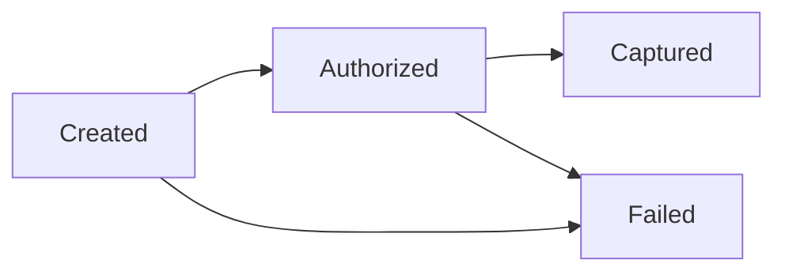

# Payments

Design · 40 min

A payment is a state machine and a ledger. The idempotency key is the part you already understand from orders.

## Flow



## Why this design shows up

It tests idempotency, money, and honesty about failure. You do not need to have worked at a bank. You need the state machine and the key. Connect it to the safe executor: a tool call that changes capacity is a state machine with a human approval edge.

## Requirements

Charge once and keep a history.

## Scale estimation

Correctness over throughput. State a modest write QPS.

## API

POST /charges with Idempotency-Key. Same key and same body returns the same charge. A different body is 409.

## Data model

Charge state and ledger lines. Balance is a sum you can rebuild.

## High-level architecture

API, database, provider call with the same key.

## DB

Postgres. The ledger is the source.

## Caching

None on the write path.

## Queue

Provider calls can be async after authorization if you split states.

## Consistency

The key and the state machine. Illegal jumps fail.

## Failure handling

Provider timeout: retry with the same key. Unknown result: reconcile.

## Observability

State counts and provider errors.

## Security

The key is bound to the authenticated caller. Amounts are integers of minor units.

## Trade-offs

A single balance column is shorter and unauditable.

## Play this

1. Idempotency key
2. Ledger entries that sum
3. Illegal state jumps fail
4. The provider call is at-least-once

## Steps

- Requirements: charge once, refund once, show a history.
- Scale: write QPS is smaller than read. Correctness dominates.
- API: POST /charges with Idempotency-Key. Same key and same body returns the same charge. Same key and a different body returns 409.
- Data: a charge row and ledger lines. The balance is the sum, or a cached sum you can rebuild.
- The provider timeout uses the same key on the retry so the provider does not capture twice.

## Example

```text
States: created, authorized, captured, failed, refunded.
captured to created is rejected.
Two ledger lines: debit the payer, credit the merchant.
```

## The usual miss

Updating a single balance column with no history.

## They will ask

The provider timed out. You retry. How many captures occur?

## Before you close the laptop

Draw the states. This is also the shape of a safe tool call.
