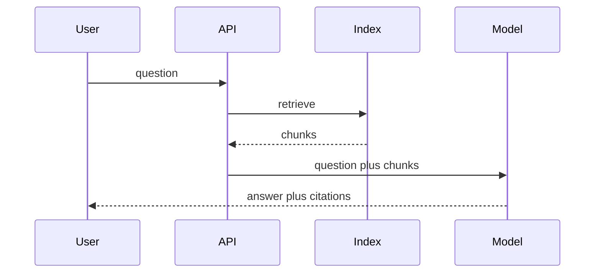

# AI chat with RAG

Design · 40 min

The design interview version of your RAG work. Retrieval, citations, and what you do when the model is wrong.

## Flow



## Walk it

The design answer is the pipeline plus failure: the model can be down, the retrieval can be empty, the citation can be wrong. Empty retrieval returns 'I do not have that' rather than a fluent guess. The eval set is part of the design, not a follow-up. Cost is a metric: tokens in, tokens out.

## Play this

1. Ingest offline
2. Retrieve before generate
3. Cite the chunk
4. Evaluate a fixed set

## Steps

- Ingestion is a pipeline, not part of the user request.
- The prompt may only use retrieved text for factual claims. If retrieval is empty, say so.
- A set of questions with expected facts. Track pass rate, latency, and cost per answer.

## Example

```text
Answer: chunk 14 says the quota is 80 percent. Link the chunk.
```

## The usual miss

A chatbot that answers from memory with no source.

## They will ask

How do you know the assistant is not inventing a root cause?

## Before you close the laptop

Write 5 evaluation questions for a fake storage runbook.
