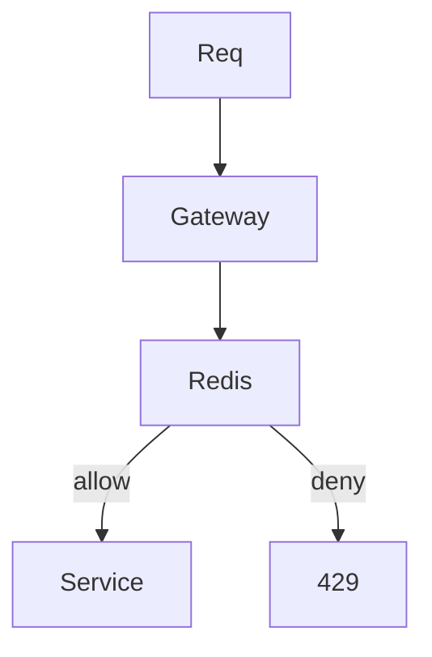

# Rate limiter

Design · 40 min

Apple and backend loops ask this because it is a small distributed system: counters, clocks, and failure.

## Flow



## Play this

1. Token bucket
2. Key is the client
3. Redis is shared
4. Fail open or closed on purpose

## Steps

- Token bucket: capacity and refill rate. Each request takes a token.
- Key by user or token, not one global bucket, unless the limit is for the whole cluster.
- If Redis is down, fail open for a product page and fail closed for a write that spends money. Say which.

## Example

```text
INCR + EXPIRE is a crude fixed window. Mention the boundary burst.
```

## The usual miss

A limiter in one process memory when you have twenty pods.

## They will ask

Two requests at the same millisecond. What happens?

## Before you close the laptop

Put this in front of the agent tool-execution endpoint. That is the same design.
