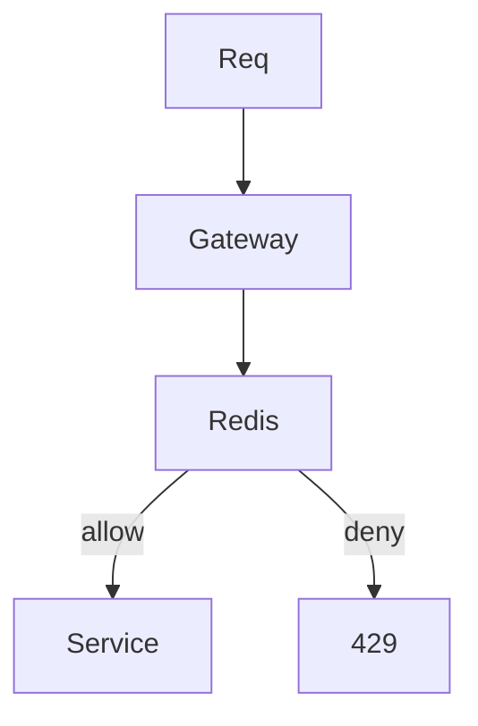

# Rate limiter

Design · 40 min

Apple and backend loops ask this because it is a small distributed system: counters, clocks, and failure.

## Flow



## Walk it

Token bucket: tokens refill with time, a request takes one. Sliding window counts requests in the last N seconds. Store the counter in Redis so every app instance sees it. The key is the client. Failure of Redis is a product decision: fail open to keep the site up, or fail closed to keep a limit. Say which, for this API. The LLD lesson is the same limiter as classes.

## Requirements

Allow or deny a client. The limit is shared across API instances.

## Scale estimation

One counter read and write per request. The key set is the client set.

## API

The limiter is inside the API, or a filter. 429 with a retry-after when denied.

## Data model

Key: client id. Value: tokens and a timestamp, or a window count.

## High-level architecture

Every instance talks to Redis. The decision is one atomic update.

## DB

Redis is the store for this counter. It is not the business database.

## Caching

This is the cache. There is no second cache.

## Queue

None. The decision is synchronous.

## Consistency

The atomic update is the consistency. A lost Redis is a product choice.

## Failure handling

Redis timeout: fail open or fail closed. Say which for this API.

## Observability

Denied count and Redis latency.

## Security

The key is the authenticated client, not a header the caller can forge.

## Trade-offs

Token bucket is smooth. A fixed window is simpler and allows a burst on the boundary.

## Play this

1. Token bucket
2. Key is the client
3. Redis is shared
4. Fail open or closed on purpose

## Steps

- Token bucket: capacity and refill rate. Each request takes a token.
- Key by user or token, not one global bucket, unless the limit is for the whole cluster.
- If Redis is down, fail open for a product page and fail closed for a write that spends money. Say which.

## Example

```text
INCR + EXPIRE is a crude fixed window. Mention the boundary burst.
```

## The usual miss

A limiter in one process memory when you have twenty pods.

## They will ask

Two requests at the same millisecond. What happens?

## Before you close the laptop

Put this in front of the agent tool-execution endpoint. That is the same design.
