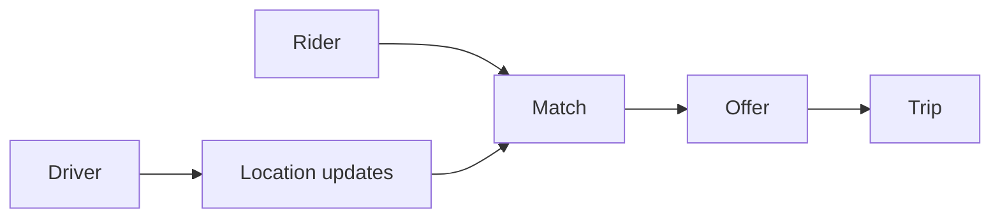

# Ride booking

Design · 30 min

The trick is matching under contention. Two riders must not take the same driver.

## Flow



## What to cut

Pricing, maps, and surge can be a single sentence: a price is computed and stored on the trip at match time. Spend the minutes on the race. This design is practice for any exclusive allocation, including a capacity reservation on a cluster.

## Play this

1. Location is a hot write
2. Match is a short transaction
3. One driver, one offer
4. The trip is a state machine

## Steps

- Requirements: request a ride, match a nearby driver, complete the trip.
- Location updates are frequent and lossy. The latest point matters. A cache or a specialized store holds them.
- Matching locks the driver row, or uses a conditional update: status = free. The loser retries with the next driver.
- States: requested, matched, started, completed, cancelled.

## Example

```text
UPDATE driver SET status = 'offered'
WHERE id = ? AND status = 'free'
```

## The usual miss

Finding the nearest driver with a full table scan and then hoping the update wins.

## They will ask

Two matchers pick the same driver. Who gets the trip?

## Before you close the laptop

Say the conditional update. That sentence is the design.
