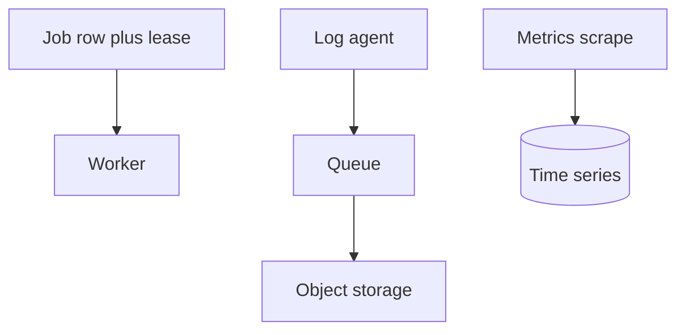

# Job scheduler, logs, and metrics

Design · 35 min

Three operational designs. Each has one trick: a lease, a buffer, and a time series.

## Flow



## Logs versus metrics

A log line is an event with a high amount of detail and a request id. A metric is a number you can alert on. You do not grep logs to page someone, and you do not put the request id into a metric label. The diagnostics agent is allowed to read both. The page is a metric.

## Play this

1. One owner via a lease
2. Logs are buffered
3. Metrics are aggregated
4. All three tolerate a dead worker

## Steps

- Scheduler: a job has a run_at and a lease_until. A worker updates the lease in a transaction. If it dies, the lease expires. The handler is idempotent because the lease can expire early.
- Logs: agents batch lines, a queue absorbs a burst, object storage keeps the bulk, an index keeps the recent window for the RCA agent.
- Metrics: counters and histograms, scraped or pushed. Retention is short at high resolution and long at low resolution. The capacity agent reads this store.

## Example

```text
UPDATE job SET lease_until = now() + interval '30 seconds'
WHERE id = ? AND lease_until < now()
```

## The usual miss

A cron on every pod.

## They will ask

Two workers run the same job. What prevents a double side effect?

## Before you close the laptop

Write the lease condition. It is the scheduler.
