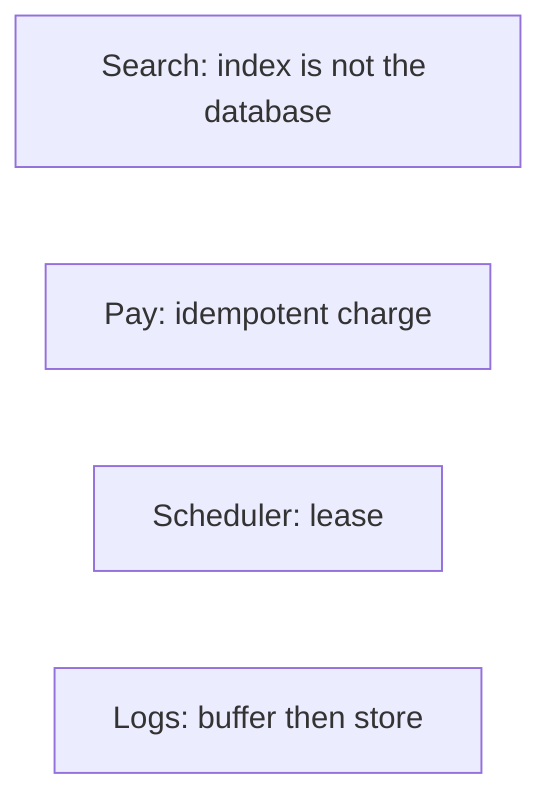

# Search, payments, scheduler, logs

Design · 45 min

Four more nouns. Each has one trick. Say the trick first.

## Flow



## Play this

1. Index asynchronously
2. Charge once
3. Only one worker owns a job
4. Logs are append-only

## Steps

- Search: the database is the source. An index (inverted or a service) is built from a stream. Queries hit the index.
- Payments: idempotency key, ledger entries that sum, and a state machine. Never a single balance update with no history.
- Scheduler: a job row with a lease timestamp. A worker updates the lease. If it dies, another worker takes the expired lease.
- Log aggregation: agents buffer, a queue absorbs bursts, object storage keeps the bulk, an index keeps the recent window.

## Example

```text
Payment states: created, authorized, captured, failed. Illegal jumps are rejected.
```

## The usual miss

A cron on every pod so the job runs five times.

## They will ask

Two API calls with the same idempotency key. How many charges?

## Before you close the laptop

Write the payment states on a card. Carry it to one mock.
