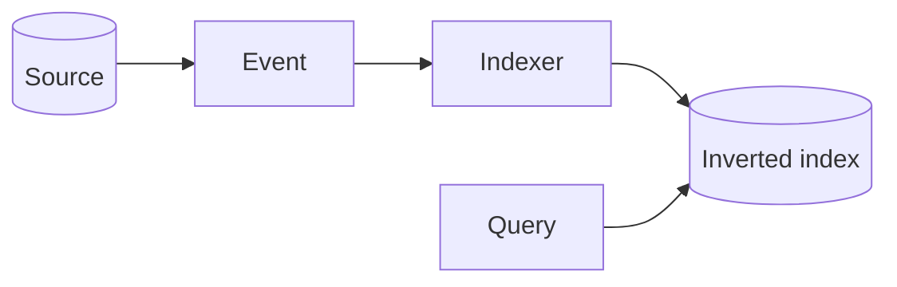

# Search

Design · 30 min

The database is the source of truth. The index is a derived store built from a stream.

## Flow



## The trick to say first

Search is a second store. It can be wrong for a while. The source cannot. Tokens, inverted lists, and a rank function are enough. You do not need to implement a search engine. You need to say what is authoritative.

## Requirements

Keyword search over object names and incident notes.

## Scale estimation

Query rate and index size. Writes are the event rate.

## API

GET /search?q= .

## Data model

Document id, tokens, source id.

## High-level architecture

The database emits an event. An indexer updates an inverted index. Queries hit the index, then load the row.

## DB

Postgres is the source. The index is derived.

## Caching

Hot queries.

## Queue

The index events.

## Consistency

Stale by the indexer lag. Say the lag.

## Failure handling

A rebuild from the database exists.

## Observability

Indexer lag and query latency.

## Security

The same authorization as the row. The index must not leak a private incident.

## Trade-offs

LIKE on the primary table is simpler and dies at size.

## Play this

1. Index is not the database
2. Build from the event stream
3. Queries hit the index
4. Rebuild is possible

## Steps

- Requirements: keyword search over object names and synthetic incident notes.
- The write path updates Postgres and emits an event. The indexer updates the inverted index.
- Search can be stale by the lag of the indexer. Say the lag.
- A full rebuild from the database exists, because indexes corrupt.

## Example

```text
Document: incident 41, tokens [disk, latency, bucket].
Query "latency" returns the document id, then the API loads the row.
```

## The usual miss

Searching with LIKE on the primary table at millions of rows.

## They will ask

The indexer is an hour behind. What does the user see?

## Before you close the laptop

Name the event that updates the index in the project.
