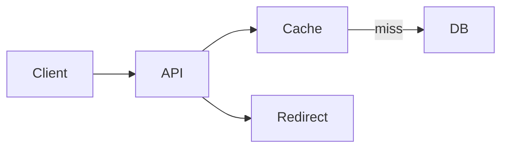

# URL shortener

Design · 40 min

The classic is a key-value write with a read-heavy cache. It teaches ids, redirects, and cache.

## Flow



## Walk it

Create returns a short id. Read redirects. The id is random or a counter encoded in base 62. Reads dominate, so a cache sits in front. The database is the source. A collision retries. Analytics are an async event, not a write on the redirect path. Estimate: reads per second, row size, cache hit ratio. That estimate is a practice, and you say the assumptions.

## Play this

1. Generate an unguessable id
2. Store url by id
3. Cache the hot ids
4. 301 versus 302

## Steps

- Write path: hash or an id service, unique constraint, return the short url.
- Read path: cache then database. Redirect. Do not count analytics on the request thread.
- Analytics is an async event. That is your first queue in this design.

## Example

```text
GET /{id} -> 302 Location
```

## The usual miss

A sequential integer id that leaks volume and is easy to scrape.

## They will ask

How do you keep one id from being issued twice?

## Before you close the laptop

Speak it once with a cache and an analytics event.
