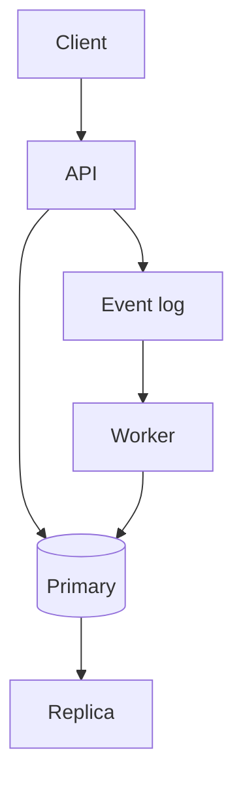

# Replication, partitions, and delivery

Distributed · 45 min

Distributed systems is the reason Kafka, retries, and idempotency exist. You already run pieces of this at Dell. The interview wants the failure story.

## Flow



## The failure you should narrate

The client timed out. The server may have committed. The client retries. Without a key, you have two orders. With a key stored in the same transaction as the order, the second call finds the first and returns it. That is the whole distributed-systems answer for a write API. Say the timeout value and what you do when the dependency is down: a bounded retry, then an error the caller can see.

## Ordering and partitions

Kafka orders inside a partition. The key decides the partition. Bucket id keeps one bucket's events ordered. A random key spreads load and loses order. Consumers in a group split partitions. You do not get global order unless you accept one partition and its throughput ceiling. Say that trade out loud.

## Clocks and leases

Machine clocks drift. A lease with a timeout is how a scheduler gives one worker a job. If the worker dies, the lease expires and another worker takes it. If the worker is slow and the lease expires while it is still working, two workers can run the job. The job handler must be idempotent too. This is the job-scheduler design in one paragraph.

## Play this

1. A timeout is not a no
2. A retry repeats the side effect
3. Idempotency makes the retry safe
4. A partition key is an ordering choice

## Steps

- Replication: a primary takes writes, replicas serve reads or stand by. Lag means a read-your-write can miss the write. Route that read to the primary.
- A network partition means a node cannot see another. Timeouts, retries, and a decision about availability follow. CAP is a reminder, not a design.
- At-least-once delivery plus an idempotent handler is the practical choice. Exactly-once is a careful composition of the log and the database, which is what the outbox approaches.
- Backpressure: if the consumer is slower than the producer, the lag grows. Scale consumers, or slow the producer. Do not let the heap be the queue.

## Example

```text
Idempotency-Key: 9f2c
First call: create the row, publish, return 201.
Second call: find the row, return 200.
No second object.
```

## The usual miss

Retrying a non-idempotent POST and hoping the cloud is kind.

## They will ask

The consumer crashes after the database write and before the offset commit. What happens?

## Before you close the laptop

Add the idempotency key to one project endpoint and the test that calls it twice.
