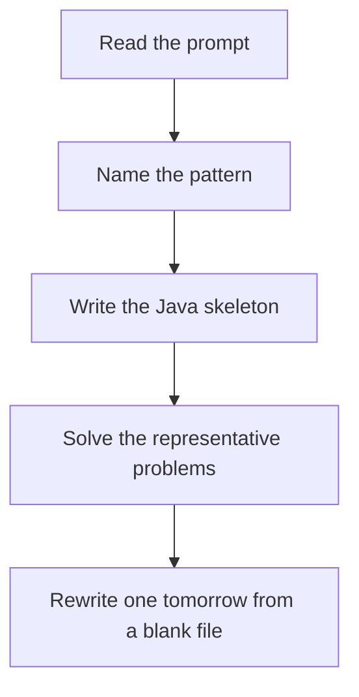

# Backtracking

DSA · one evening

After the January core is green. The state is the partial decision. Recurse with that decision applied, then revert it so the next sibling sees a clean board.

## Flow



## How to recognize it

Generate all combinations, permutations, partitions, or placements You choose, explore, and undo Constraints prune the tree: queens attack, cells already used, remaining sum Two of these in the prompt is enough. Say the pattern name out loud, then open the editor.

## The idea

The state is the partial decision. Recurse with that decision applied, then revert it so the next sibling sees a clean board.

## Java template

Type this from memory. Only the condition inside the loop changes between problems in this family.

```text
void dfs(int start, int remain, List<Integer> path) {
    if (remain == 0) { answer.add(new ArrayList<>(path)); return; }
    for (int i = start; i < candidates.length; i++) {
        if (candidates[i] > remain) break;
        path.add(candidates[i]);
        dfs(i, remain - candidates[i], path);
        path.remove(path.size() - 1);
    }
}
```

## Problems that count

Combination Sum (Medium). Reuse the same index if the number can repeat. Copy the path.

Permutations (Medium). Used array, or swap in place and swap back.

N-Queens (Hard). Column, diagonal, anti-diagonal sets. One queen per row.

## Mistakes that make you blank in the interview

Adding the path without copying it. The list is mutated later. Forgetting to undo a board cell Starting the next loop at 0 and generating permutations when you wanted combinations

## When this sits in the calendar

Do this only after the January patterns rewrite cleanly. One evening, one problem. It is not equal in weight to sliding window or basic DP.

## Play this

1. Name it before coding
2. Write the skeleton from memory
3. Solve the listed problems
4. Blank rewrite the next day

## Steps

- Recognition: Generate all combinations, permutations, partitions, or placements You choose, explore, and undo Constraints prune the tree: queens attack, cells already used, remaining sum
- If you cannot name it in a minute, this is pass 1: read one solution, then code it yourself.
- Pass 2 is the next day, empty file, no video. Pass 3 is day 3, pass 4 is day 7, pass 5 is day 15 to 30.
- Mark the attempt on the Patterns tab. Green means the rewrite worked alone.

## Example

```text
void dfs(int start, int remain, List<Integer> path) {
    if (remain == 0) { answer.add(new ArrayList<>(path)); return; }
    for (int i = start; i < candidates.length; i++) {
        if (candidates[i] > remain) break;
        path.add(candidates[i]);
        dfs(i, remain - candidates[i], path);
        path.remove(path.size() - 1);
    }
}
```

## The usual miss

Adding the path without copying it. The list is mutated later.

## They will ask

Walk Combination Sum and say why this pattern fits.

## Before you close the laptop

Rewrite Combination Sum tomorrow before any new pattern.
