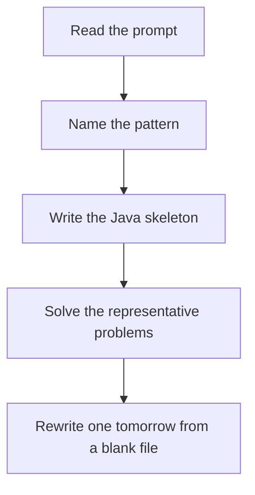

# Binary search on the answer

DSA · 75 min

January. If X works, every larger X works (or the opposite). Binary search the boundary. The check function is usually a greedy scan.

## Flow



## How to recognize it

Minimize the maximum, or maximize the minimum A yes/no check exists: 'can I achieve capacity X?' The search space is a number range, not an index in the array Two of these in the prompt is enough. Say the pattern name out loud, then open the editor.

## The idea

If X works, every larger X works (or the opposite). Binary search the boundary. The check function is usually a greedy scan.

## Java template

Type this from memory. Only the condition inside the loop changes between problems in this family.

```text
int low = 1;
int high = maxPossible;
while (low < high) {
    int mid = low + (high - low) / 2;
    if (can(mid)) high = mid;
    else low = mid + 1;
}
```

## Problems that count

Koko Eating Bananas (Medium). Minimum speed. Check is hours needed at speed mid.

Capacity To Ship Packages Within D Days (Medium). Minimum capacity. Same shape as book allocation.

Split Array Largest Sum (Hard). This is book allocation / painter partition. One pattern, three stories.

## Mistakes that make you blank in the interview

Binary searching the array index instead of the answer value A check function that is not monotonic Off-by-one on low < high when you want the minimum feasible

## When this sits in the calendar

This is in the January must-set. It belongs in the 75-minute DSA block on weekdays. Do not add a new pattern on a day the previous rewrite failed.

## Play this

1. Name it before coding
2. Write the skeleton from memory
3. Solve the listed problems
4. Blank rewrite the next day

## Steps

- Recognition: Minimize the maximum, or maximize the minimum A yes/no check exists: 'can I achieve capacity X?' The search space is a number range, not an index in the array
- If you cannot name it in a minute, this is pass 1: read one solution, then code it yourself.
- Pass 2 is the next day, empty file, no video. Pass 3 is day 3, pass 4 is day 7, pass 5 is day 15 to 30.
- Mark the attempt on the Patterns tab. Green means the rewrite worked alone.

## Example

```text
int low = 1;
int high = maxPossible;
while (low < high) {
    int mid = low + (high - low) / 2;
    if (can(mid)) high = mid;
    else low = mid + 1;
}
```

## The usual miss

Binary searching the array index instead of the answer value

## They will ask

Walk Koko Eating Bananas and say why this pattern fits.

## Before you close the laptop

Rewrite Koko Eating Bananas tomorrow before any new pattern.
