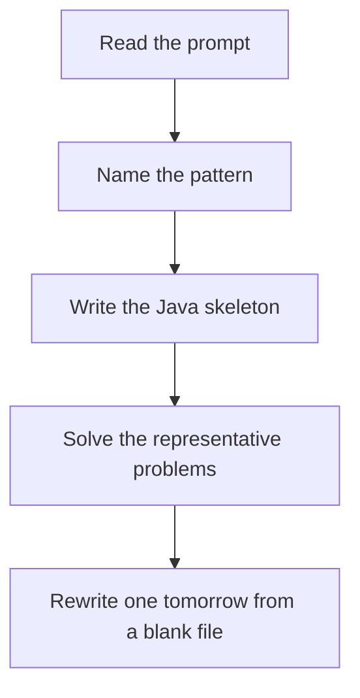

# Binary search

DSA · 75 min

January. Keep a range where the answer is still possible. Each step throws away half. Decide which half using the middle, then be strict about inclusive bounds.

## Flow



## How to recognize it

Sorted, rotated sorted, or a predicate that flips from false to true once Find first, last, or any position O(log n) is required or the array is huge Two of these in the prompt is enough. Say the pattern name out loud, then open the editor.

## The idea

Keep a range where the answer is still possible. Each step throws away half. Decide which half using the middle, then be strict about inclusive bounds.

## Java template

Type this from memory. Only the condition inside the loop changes between problems in this family.

```text
int left = 0;
int right = nums.length - 1;
while (left <= right) {
    int mid = left + (right - left) / 2;
    if (nums[mid] == target) return mid;
    if (nums[mid] < target) left = mid + 1;
    else right = mid - 1;
}
```

## Problems that count

Binary Search (Easy). Write it closed-interval until you cannot get it wrong.

Search in Rotated Sorted Array (Medium). One half is always sorted. Search there if target lies inside it.

Find First and Last Position (Medium). Two searches: lower bound and upper bound.

## Mistakes that make you blank in the interview

mid = (left + right) / 2 overflowing on large bounds. Use left + (right - left) / 2 left < right vs left <= right mixed up, so you loop forever or drop the last index On a rotated array, forgetting to first ask which half is sorted

## When this sits in the calendar

This is in the January must-set. It belongs in the 75-minute DSA block on weekdays. Do not add a new pattern on a day the previous rewrite failed.

## Play this

1. Name it before coding
2. Write the skeleton from memory
3. Solve the listed problems
4. Blank rewrite the next day

## Steps

- Recognition: Sorted, rotated sorted, or a predicate that flips from false to true once Find first, last, or any position O(log n) is required or the array is huge
- If you cannot name it in a minute, this is pass 1: read one solution, then code it yourself.
- Pass 2 is the next day, empty file, no video. Pass 3 is day 3, pass 4 is day 7, pass 5 is day 15 to 30.
- Mark the attempt on the Patterns tab. Green means the rewrite worked alone.

## Example

```text
int left = 0;
int right = nums.length - 1;
while (left <= right) {
    int mid = left + (right - left) / 2;
    if (nums[mid] == target) return mid;
    if (nums[mid] < target) left = mid + 1;
    else right = mid - 1;
}
```

## The usual miss

mid = (left + right) / 2 overflowing on large bounds. Use left + (right - left) / 2

## They will ask

Walk Binary Search and say why this pattern fits.

## Before you close the laptop

Rewrite Binary Search tomorrow before any new pattern.
