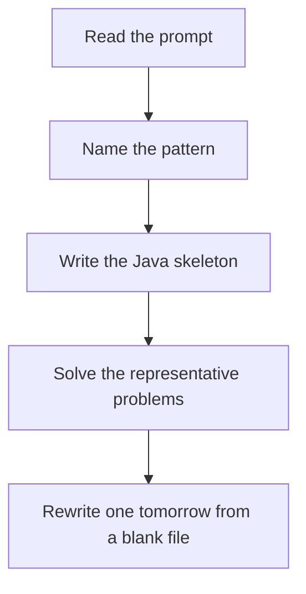

# Bit and XOR

DSA · one evening

After the January core is green. XOR cancels pairs: a ^ a = 0 and a ^ 0 = a. For two singles, the lowest set bit of the XOR splits them into two groups.

## Flow



## How to recognize it

Every element appears twice except one, or twice except two Find the missing number without extra memory The problem mentions bits, parity, or 'constant space' Two of these in the prompt is enough. Say the pattern name out loud, then open the editor.

## The idea

XOR cancels pairs: a ^ a = 0 and a ^ 0 = a. For two singles, the lowest set bit of the XOR splits them into two groups.

## Java template

Type this from memory. Only the condition inside the loop changes between problems in this family.

```text
int xor = 0;
for (int value : nums) xor ^= value;
return xor;
```

## Problems that count

Single Number (Easy). XOR the array.

Single Number II (Medium). Count each bit mod 3.

Missing Number (Easy). XOR indexes and values, or the gauss formula.

## Mistakes that make you blank in the interview

Using XOR for counts of three. Single Number II needs bit counts mod 3. Forgetting 0 ^ x = x and dropping the missing number range Writing a HashSet solution and moving on. Do the bit version once.

## When this sits in the calendar

Do this only after the January patterns rewrite cleanly. One evening, one problem. It is not equal in weight to sliding window or basic DP.

## Play this

1. Name it before coding
2. Write the skeleton from memory
3. Solve the listed problems
4. Blank rewrite the next day

## Steps

- Recognition: Every element appears twice except one, or twice except two Find the missing number without extra memory The problem mentions bits, parity, or 'constant space'
- If you cannot name it in a minute, this is pass 1: read one solution, then code it yourself.
- Pass 2 is the next day, empty file, no video. Pass 3 is day 3, pass 4 is day 7, pass 5 is day 15 to 30.
- Mark the attempt on the Patterns tab. Green means the rewrite worked alone.

## Example

```text
int xor = 0;
for (int value : nums) xor ^= value;
return xor;
```

## The usual miss

Using XOR for counts of three. Single Number II needs bit counts mod 3.

## They will ask

Walk Single Number and say why this pattern fits.

## Before you close the laptop

Rewrite Single Number tomorrow before any new pattern.
