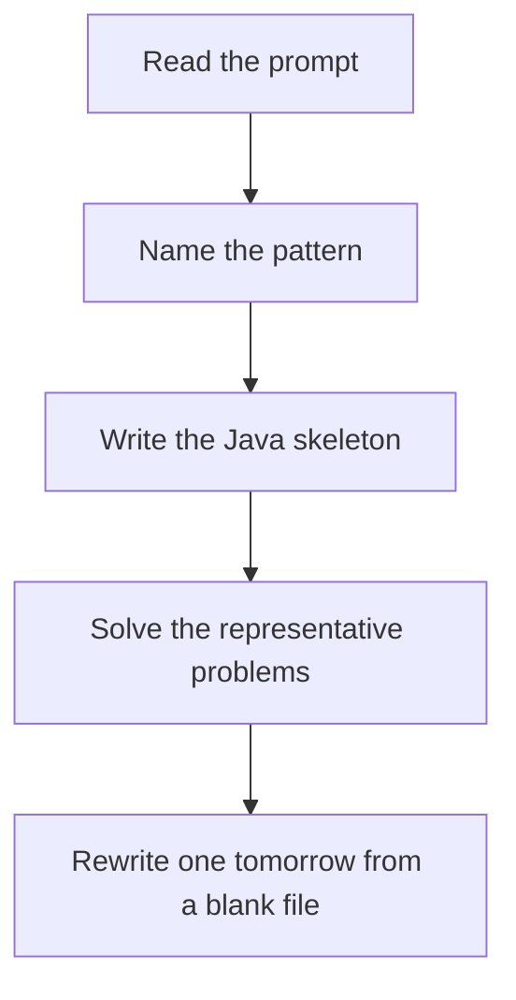

# BST inorder property

DSA · 75 min

January. Inorder walks values in sorted order. Most BST questions are 'do something on a sorted array' while you walk.

## Flow



## How to recognize it

The tree is a BST, not a general binary tree Kth smallest, validate, successor, two sum Inorder is sorted Two of these in the prompt is enough. Say the pattern name out loud, then open the editor.

## The idea

Inorder walks values in sorted order. Most BST questions are 'do something on a sorted array' while you walk.

## Java template

Type this from memory. Only the condition inside the loop changes between problems in this family.

```text
void inorder(TreeNode node) {
    if (node == null) return;
    inorder(node.left);
    // node.val is the next sorted value
    inorder(node.right);
}
```

## Problems that count

Validate Binary Search Tree (Medium). Pass a low and high bound, not just the parent.

Kth Smallest Element in a BST (Medium). Inorder count. Stop at k.

Lowest Common Ancestor of a BST (Medium). Split: one target on each side. Else go left or right.

## Mistakes that make you blank in the interview

Running a general-tree LCA when the BST lets you compare with the target and drop a side Validating only against the parent, not against the whole ancestor range Collecting the entire inorder list when a counter would do

## When this sits in the calendar

This is in the January must-set. It belongs in the 75-minute DSA block on weekdays. Do not add a new pattern on a day the previous rewrite failed.

## Play this

1. Name it before coding
2. Write the skeleton from memory
3. Solve the listed problems
4. Blank rewrite the next day

## Steps

- Recognition: The tree is a BST, not a general binary tree Kth smallest, validate, successor, two sum Inorder is sorted
- If you cannot name it in a minute, this is pass 1: read one solution, then code it yourself.
- Pass 2 is the next day, empty file, no video. Pass 3 is day 3, pass 4 is day 7, pass 5 is day 15 to 30.
- Mark the attempt on the Patterns tab. Green means the rewrite worked alone.

## Example

```text
void inorder(TreeNode node) {
    if (node == null) return;
    inorder(node.left);
    // node.val is the next sorted value
    inorder(node.right);
}
```

## The usual miss

Running a general-tree LCA when the BST lets you compare with the target and drop a side

## They will ask

Walk Validate Binary Search Tree and say why this pattern fits.

## Before you close the laptop

Rewrite Validate Binary Search Tree tomorrow before any new pattern.
