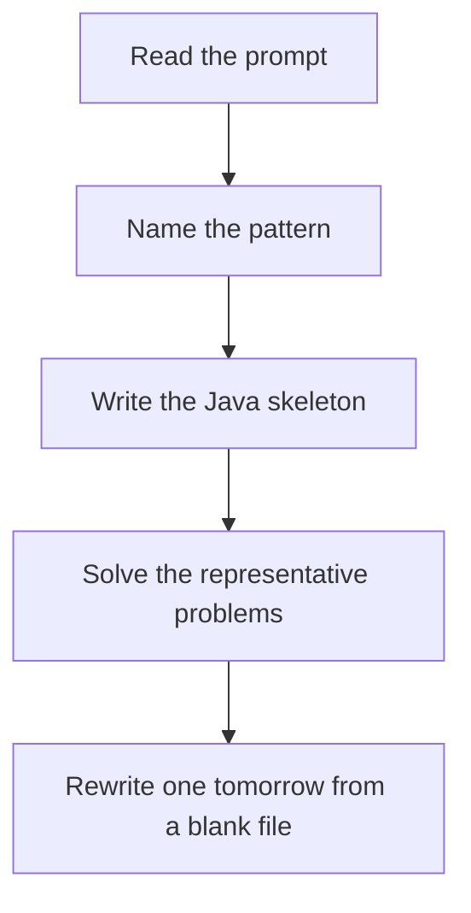

# Cycle and bipartite

DSA · 75 min

January. Directed: three colors, visiting and visited. A back edge into visiting is a cycle. Undirected: a visited neighbor that is not the parent is a cycle. Bipartite: BFS colors, and a neighbor with your color breaks it.

## Flow



## How to recognize it

Detect a loop in directed or undirected graph Can you 2-color the nodes Prerequisites that might be circular Two of these in the prompt is enough. Say the pattern name out loud, then open the editor.

## The idea

Directed: three colors, visiting and visited. A back edge into visiting is a cycle. Undirected: a visited neighbor that is not the parent is a cycle. Bipartite: BFS colors, and a neighbor with your color breaks it.

## Java template

Type this from memory. Only the condition inside the loop changes between problems in this family.

```text
// 0 unseen, 1 visiting, 2 done
boolean dfs(int node) {
    state[node] = 1;
    for (int next : graph[node]) {
        if (state[next] == 1) return true;
        if (state[next] == 0 && dfs(next)) return true;
    }
    state[node] = 2;
    return false;
}
```

## Problems that count

Course Schedule (Medium). Directed cycle. If there is a cycle, you cannot finish.

Is Graph Bipartite (Medium). Odd cycle means not bipartite. Color with BFS.

Redundant Connection (Medium). Undirected cycle. DSU fits this one even better.

## Mistakes that make you blank in the interview

Using the undirected parent rule on a directed graph Two colors stored as visited boolean, so you cannot tell a back edge from a cross edge Building the adjacency list in the wrong direction for prerequisites

## When this sits in the calendar

This is in the January must-set. It belongs in the 75-minute DSA block on weekdays. Do not add a new pattern on a day the previous rewrite failed.

## Play this

1. Name it before coding
2. Write the skeleton from memory
3. Solve the listed problems
4. Blank rewrite the next day

## Steps

- Recognition: Detect a loop in directed or undirected graph Can you 2-color the nodes Prerequisites that might be circular
- If you cannot name it in a minute, this is pass 1: read one solution, then code it yourself.
- Pass 2 is the next day, empty file, no video. Pass 3 is day 3, pass 4 is day 7, pass 5 is day 15 to 30.
- Mark the attempt on the Patterns tab. Green means the rewrite worked alone.

## Example

```text
// 0 unseen, 1 visiting, 2 done
boolean dfs(int node) {
    state[node] = 1;
    for (int next : graph[node]) {
        if (state[next] == 1) return true;
        if (state[next] == 0 && dfs(next)) return true;
    }
    state[node] = 2;
    return false;
}
```

## The usual miss

Using the undirected parent rule on a directed graph

## They will ask

Walk Course Schedule and say why this pattern fits.

## Before you close the laptop

Rewrite Course Schedule tomorrow before any new pattern.
