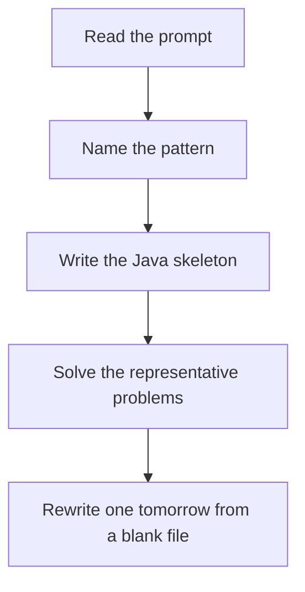

# 1D DP

DSA · 75 min

January. Write the recurrence in words first. dp[i] is the answer for the prefix ending at i. Then see if you only need the last two values.

## Flow



## How to recognize it

Climb stairs, rob houses, frog jumps, decode ways The answer at i depends on a fixed small set of earlier answers Recursion with the same arguments repeats Two of these in the prompt is enough. Say the pattern name out loud, then open the editor.

## The idea

Write the recurrence in words first. dp[i] is the answer for the prefix ending at i. Then see if you only need the last two values.

## Java template

Type this from memory. Only the condition inside the loop changes between problems in this family.

```text
int prev2 = 1; // ways to stand before the first step
int prev1 = 1;
for (int i = 2; i <= n; i++) {
    int cur = prev1 + prev2;
    prev2 = prev1;
    prev1 = cur;
}
```

## Problems that count

Climbing Stairs (Easy). Fibonacci. Say why dp[i] = dp[i-1] + dp[i-2].

House Robber (Medium). Rob this house plus dp[i-2], or skip and take dp[i-1].

House Robber II (Medium). Houses form a circle. Run the linear solution twice, without first or without last.

## Mistakes that make you blank in the interview

Coding a 2D table for a recurrence that is one array House Robber including both neighbors Jumping to memo code before you can say the state in one sentence

## When this sits in the calendar

This is in the January must-set. It belongs in the 75-minute DSA block on weekdays. Do not add a new pattern on a day the previous rewrite failed.

## Play this

1. Name it before coding
2. Write the skeleton from memory
3. Solve the listed problems
4. Blank rewrite the next day

## Steps

- Recognition: Climb stairs, rob houses, frog jumps, decode ways The answer at i depends on a fixed small set of earlier answers Recursion with the same arguments repeats
- If you cannot name it in a minute, this is pass 1: read one solution, then code it yourself.
- Pass 2 is the next day, empty file, no video. Pass 3 is day 3, pass 4 is day 7, pass 5 is day 15 to 30.
- Mark the attempt on the Patterns tab. Green means the rewrite worked alone.

## Example

```text
int prev2 = 1; // ways to stand before the first step
int prev1 = 1;
for (int i = 2; i <= n; i++) {
    int cur = prev1 + prev2;
    prev2 = prev1;
    prev1 = cur;
}
```

## The usual miss

Coding a 2D table for a recurrence that is one array

## They will ask

Walk Climbing Stairs and say why this pattern fits.

## Before you close the laptop

Rewrite Climbing Stairs tomorrow before any new pattern.
