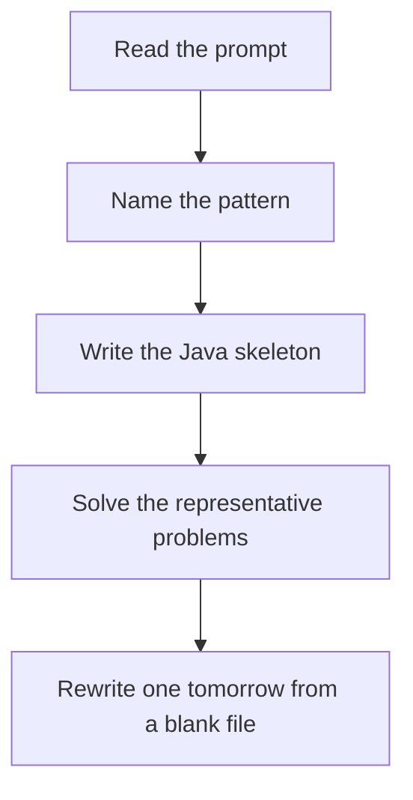

# Disjoint set union

DSA · one evening

After the January core is green. Parent array plus rank or size. Find compresses the path. Union attaches the smaller tree under the larger.

## Flow



## How to recognize it

Merge groups, connectivity, 'are these two in the same component' online Accounts merge, number of provinces, redundant edge You do not need the actual path, only the group Two of these in the prompt is enough. Say the pattern name out loud, then open the editor.

## The idea

Parent array plus rank or size. Find compresses the path. Union attaches the smaller tree under the larger.

## Java template

Type this from memory. Only the condition inside the loop changes between problems in this family.

```text
int find(int x) {
    if (parent[x] != x) parent[x] = find(parent[x]);
    return parent[x];
}
boolean union(int a, int b) {
    int pa = find(a), pb = find(b);
    if (pa == pb) return false;
    parent[pb] = pa;
    return true;
}
```

## Problems that count

Number of Provinces (Medium). Each successful union reduces the component count.

Redundant Connection (Medium). The edge that connects two nodes already in the same set.

Accounts Merge (Medium). Union emails that share an account. Group by root.

## Mistakes that make you blank in the interview

Forgetting path compression and then timing out Union by comparing raw indexes instead of roots Accounts merge: union emails, then forget to map the root email back to a name

## When this sits in the calendar

Do this only after the January patterns rewrite cleanly. One evening, one problem. It is not equal in weight to sliding window or basic DP.

## Play this

1. Name it before coding
2. Write the skeleton from memory
3. Solve the listed problems
4. Blank rewrite the next day

## Steps

- Recognition: Merge groups, connectivity, 'are these two in the same component' online Accounts merge, number of provinces, redundant edge You do not need the actual path, only the group
- If you cannot name it in a minute, this is pass 1: read one solution, then code it yourself.
- Pass 2 is the next day, empty file, no video. Pass 3 is day 3, pass 4 is day 7, pass 5 is day 15 to 30.
- Mark the attempt on the Patterns tab. Green means the rewrite worked alone.

## Example

```text
int find(int x) {
    if (parent[x] != x) parent[x] = find(parent[x]);
    return parent[x];
}
boolean union(int a, int b) {
    int pa = find(a), pb = find(b);
    if (pa == pb) return false;
    parent[pb] = pa;
    return true;
}
```

## The usual miss

Forgetting path compression and then timing out

## They will ask

Walk Number of Provinces and say why this pattern fits.

## Before you close the laptop

Rewrite Number of Provinces tomorrow before any new pattern.
