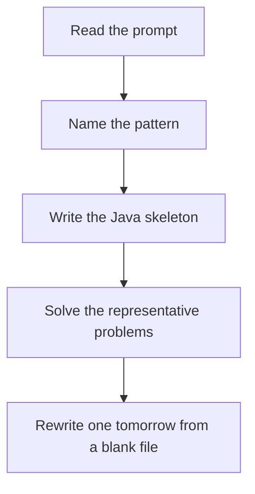

# Fast / slow pointers

DSA · 75 min

January. In a cycle the fast pointer gains one step per loop and must land on the slow pointer. The meeting point is not always the start; reset one pointer to head to find the start.

## Flow



## How to recognize it

Linked list, find the middle, a cycle, or the cycle start You cannot index the list One pointer moving twice as fast meets the other Two of these in the prompt is enough. Say the pattern name out loud, then open the editor.

## The idea

In a cycle the fast pointer gains one step per loop and must land on the slow pointer. The meeting point is not always the start; reset one pointer to head to find the start.

## Java template

Type this from memory. Only the condition inside the loop changes between problems in this family.

```text
ListNode slow = head;
ListNode fast = head;
while (fast != null && fast.next != null) {
    slow = slow.next;
    fast = fast.next.next;
}
```

## Problems that count

Middle of the Linked List (Easy). When fast finishes, slow is the middle.

Linked List Cycle (Easy). Meet means a cycle. No map.

Linked List Cycle II (Medium). After they meet, walk head and slow one step at a time.

## Mistakes that make you blank in the interview

Null-checking only fast, then reading fast.next.next Returning the meeting node as the cycle entrance Using an extra HashSet when the question is teaching Floyd

## When this sits in the calendar

This is in the January must-set. It belongs in the 75-minute DSA block on weekdays. Do not add a new pattern on a day the previous rewrite failed.

## Play this

1. Name it before coding
2. Write the skeleton from memory
3. Solve the listed problems
4. Blank rewrite the next day

## Steps

- Recognition: Linked list, find the middle, a cycle, or the cycle start You cannot index the list One pointer moving twice as fast meets the other
- If you cannot name it in a minute, this is pass 1: read one solution, then code it yourself.
- Pass 2 is the next day, empty file, no video. Pass 3 is day 3, pass 4 is day 7, pass 5 is day 15 to 30.
- Mark the attempt on the Patterns tab. Green means the rewrite worked alone.

## Example

```text
ListNode slow = head;
ListNode fast = head;
while (fast != null && fast.next != null) {
    slow = slow.next;
    fast = fast.next.next;
}
```

## The usual miss

Null-checking only fast, then reading fast.next.next

## They will ask

Walk Middle of the Linked List and say why this pattern fits.

## Before you close the laptop

Rewrite Middle of the Linked List tomorrow before any new pattern.
