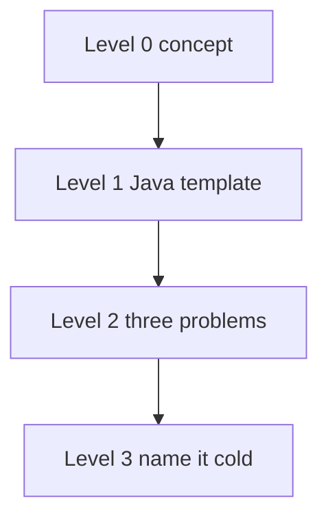

# Four levels for every pattern

DSA · 15 min

A pattern is mastered when you can name it from a prompt, write the Java skeleton, solve three problems, and recognize a new one. A green tick the night you watched a video is not level 3.

## Flow



## Two pointers, as the example

Level 0 is the picture: left moves right, right moves left, on a sorted array. Level 1 is the while loop. Level 2 is Two Sum II, 3Sum, and Container With Most Water. Level 3 is hearing 'sorted, find a pair' and saying two pointers before you ask for a hint. Every other pattern in this guide uses the same four levels.

```text
int left = 0;
int right = n - 1;
while (left < right) {
    // move the side that is wrong
}
```

## Play this

1. Concept before code
2. Skeleton from memory
3. Three problems, not thirty
4. Recognition is the interview

## Steps

- Level 0: when does this pattern apply? For two pointers: sorted, pair or triplet, move inward, skip duplicates.
- Level 1: the Java loop, written with the video closed.
- Level 2: two to four problems, easy then medium. Hard only if it is the same skeleton.
- Level 3: a random prompt. You say the pattern name before you write code.

## Example

```text
Two pointers
left = 0, right = n - 1
while (left < right)
  sum too small -> left++
  sum too big -> right--
```

## The usual miss

Collecting thirty problems and being unable to name the pattern.

## They will ask

Sorted array, find a pair with a target sum. What do you say first?

## Before you close the laptop

Pick tomorrow's pattern and write only the skeleton tonight.
