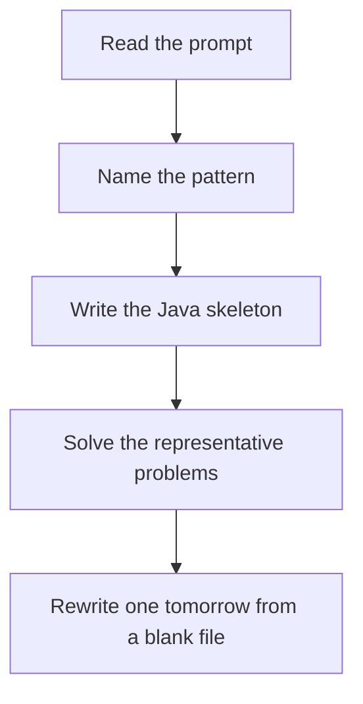

# Graph BFS / DFS

DSA · 75 min

January. DFS explores a component. BFS explores by distance. Mark visited when you enqueue or enter, not when you leave, or you will process the same cell many times.

## Flow



## How to recognize it

Grid of land and water, rooms, or connected components Shortest path in an unweighted graph Visit each node or cell once Two of these in the prompt is enough. Say the pattern name out loud, then open the editor.

## The idea

DFS explores a component. BFS explores by distance. Mark visited when you enqueue or enter, not when you leave, or you will process the same cell many times.

## Java template

Type this from memory. Only the condition inside the loop changes between problems in this family.

```text
void dfs(int r, int c) {
    if (r < 0 || c < 0 || r >= m || c >= n || grid[r][c] == '0') return;
    grid[r][c] = '0';
    dfs(r + 1, c); dfs(r - 1, c); dfs(r, c + 1); dfs(r, c - 1);
}
```

## Problems that count

Number of Islands (Medium). Each DFS sinks one island.

Rotting Oranges (Medium). Multi-source BFS. Minute equals a layer.

Clone Graph (Medium). Map from original node to the copy. DFS or BFS.

## Mistakes that make you blank in the interview

Marking visited on exit, so the queue fills with duplicates Using DFS for shortest path in an unweighted grid Forgetting the 4-direction vs 8-direction the problem asked for

## When this sits in the calendar

This is in the January must-set. It belongs in the 75-minute DSA block on weekdays. Do not add a new pattern on a day the previous rewrite failed.

## Play this

1. Name it before coding
2. Write the skeleton from memory
3. Solve the listed problems
4. Blank rewrite the next day

## Steps

- Recognition: Grid of land and water, rooms, or connected components Shortest path in an unweighted graph Visit each node or cell once
- If you cannot name it in a minute, this is pass 1: read one solution, then code it yourself.
- Pass 2 is the next day, empty file, no video. Pass 3 is day 3, pass 4 is day 7, pass 5 is day 15 to 30.
- Mark the attempt on the Patterns tab. Green means the rewrite worked alone.

## Example

```text
void dfs(int r, int c) {
    if (r < 0 || c < 0 || r >= m || c >= n || grid[r][c] == '0') return;
    grid[r][c] = '0';
    dfs(r + 1, c); dfs(r - 1, c); dfs(r, c + 1); dfs(r, c - 1);
}
```

## The usual miss

Marking visited on exit, so the queue fills with duplicates

## They will ask

Walk Number of Islands and say why this pattern fits.

## Before you close the laptop

Rewrite Number of Islands tomorrow before any new pattern.
