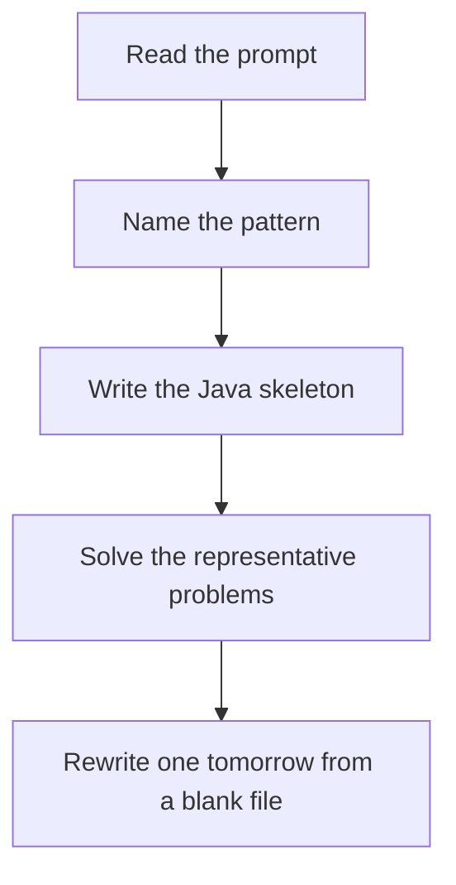

# Greedy

DSA · 75 min

January. Sort by the thing that matters, then take the best available choice. If you cannot explain why a later choice cannot beat it, it is not greedy — it is DP.

## Flow



## How to recognize it

A local choice never needs to be undone Jump as far as you can, schedule the earliest finish, give the smallest cookie that works You can prove the choice with an exchange argument, even informally Two of these in the prompt is enough. Say the pattern name out loud, then open the editor.

## The idea

Sort by the thing that matters, then take the best available choice. If you cannot explain why a later choice cannot beat it, it is not greedy — it is DP.

## Java template

Type this from memory. Only the condition inside the loop changes between problems in this family.

```text
// Jump Game II: track the farthest reach of this jump window
int jumps = 0, end = 0, far = 0;
for (int i = 0; i < nums.length - 1; i++) {
    far = Math.max(far, i + nums[i]);
    if (i == end) { jumps++; end = far; }
}
```

## Problems that count

Jump Game (Medium). Track the farthest index you can reach.

Jump Game II (Medium). Count windows of jumps, not every step.

Gas Station (Medium). If total gas >= total cost, the unique start is where the tank bottomed out.

## Mistakes that make you blank in the interview

Greedy on a problem that needs you to try both choices. Coin change with weird denominations is DP. Sorting the wrong key Jump Game I (can reach) and II (minimum jumps) solved with the same code

## When this sits in the calendar

This is in the January must-set. It belongs in the 75-minute DSA block on weekdays. Do not add a new pattern on a day the previous rewrite failed.

## Play this

1. Name it before coding
2. Write the skeleton from memory
3. Solve the listed problems
4. Blank rewrite the next day

## Steps

- Recognition: A local choice never needs to be undone Jump as far as you can, schedule the earliest finish, give the smallest cookie that works You can prove the choice with an exchange argument, even informally
- If you cannot name it in a minute, this is pass 1: read one solution, then code it yourself.
- Pass 2 is the next day, empty file, no video. Pass 3 is day 3, pass 4 is day 7, pass 5 is day 15 to 30.
- Mark the attempt on the Patterns tab. Green means the rewrite worked alone.

## Example

```text
// Jump Game II: track the farthest reach of this jump window
int jumps = 0, end = 0, far = 0;
for (int i = 0; i < nums.length - 1; i++) {
    far = Math.max(far, i + nums[i]);
    if (i == end) { jumps++; end = far; }
}
```

## The usual miss

Greedy on a problem that needs you to try both choices. Coin change with weird denominations is DP.

## They will ask

Walk Jump Game and say why this pattern fits.

## Before you close the laptop

Rewrite Jump Game tomorrow before any new pattern.
