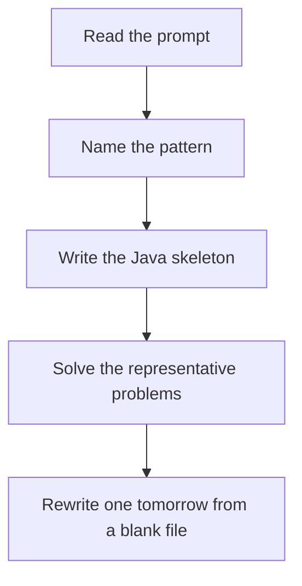

# Grid DP

DSA · 75 min

January. dp[r][c] comes from the cells that can move into it. Fill in an order that already knows those cells.

## Flow



## How to recognize it

Paths across a grid, minimum path sum, falling paths, triangle You only move right/down, or to adjacent cells in the next row Overlapping subproblems on cells Two of these in the prompt is enough. Say the pattern name out loud, then open the editor.

## The idea

dp[r][c] comes from the cells that can move into it. Fill in an order that already knows those cells.

## Java template

Type this from memory. Only the condition inside the loop changes between problems in this family.

```text
for (int r = 0; r < m; r++) {
    for (int c = 0; c < n; c++) {
        if (r == 0 && c == 0) continue;
        int fromTop = r > 0 ? dp[r - 1][c] : Integer.MAX_VALUE;
        int fromLeft = c > 0 ? dp[r][c - 1] : Integer.MAX_VALUE;
        dp[r][c] = grid[r][c] + Math.min(fromTop, fromLeft);
    }
}
```

## Problems that count

Unique Paths (Medium). Combinatorics works too. Still write the DP once.

Minimum Path Sum (Medium). Add the cell to the min of top and left.

Triangle (Medium). Bottom-up from the last row saves you the boundary pain.

## Mistakes that make you blank in the interview

Integer overflow when seeding unreachable cells with Integer.MAX_VALUE and then adding Walking the grid with DFS and no memo, then wondering why it TLEs Unique Paths obstacles: a blocked cell is 0 ways, and it must not add into neighbors

## When this sits in the calendar

This is in the January must-set. It belongs in the 75-minute DSA block on weekdays. Do not add a new pattern on a day the previous rewrite failed.

## Play this

1. Name it before coding
2. Write the skeleton from memory
3. Solve the listed problems
4. Blank rewrite the next day

## Steps

- Recognition: Paths across a grid, minimum path sum, falling paths, triangle You only move right/down, or to adjacent cells in the next row Overlapping subproblems on cells
- If you cannot name it in a minute, this is pass 1: read one solution, then code it yourself.
- Pass 2 is the next day, empty file, no video. Pass 3 is day 3, pass 4 is day 7, pass 5 is day 15 to 30.
- Mark the attempt on the Patterns tab. Green means the rewrite worked alone.

## Example

```text
for (int r = 0; r < m; r++) {
    for (int c = 0; c < n; c++) {
        if (r == 0 && c == 0) continue;
        int fromTop = r > 0 ? dp[r - 1][c] : Integer.MAX_VALUE;
        int fromLeft = c > 0 ? dp[r][c - 1] : Integer.MAX_VALUE;
        dp[r][c] = grid[r][c] + Math.min(fromTop, fromLeft);
    }
}
```

## The usual miss

Integer overflow when seeding unreachable cells with Integer.MAX_VALUE and then adding

## They will ask

Walk Unique Paths and say why this pattern fits.

## Before you close the laptop

Rewrite Unique Paths tomorrow before any new pattern.
